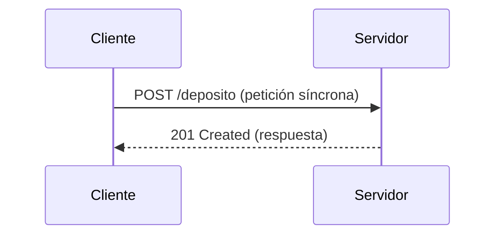
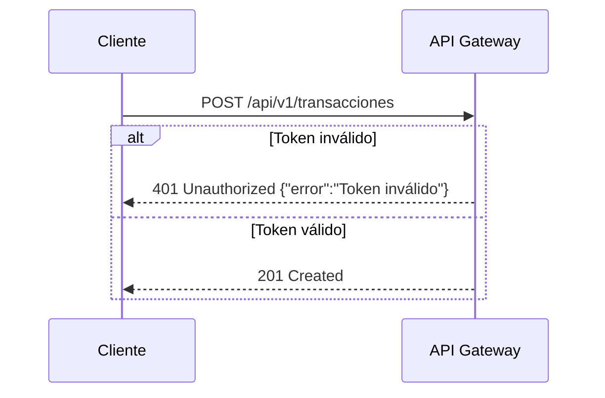
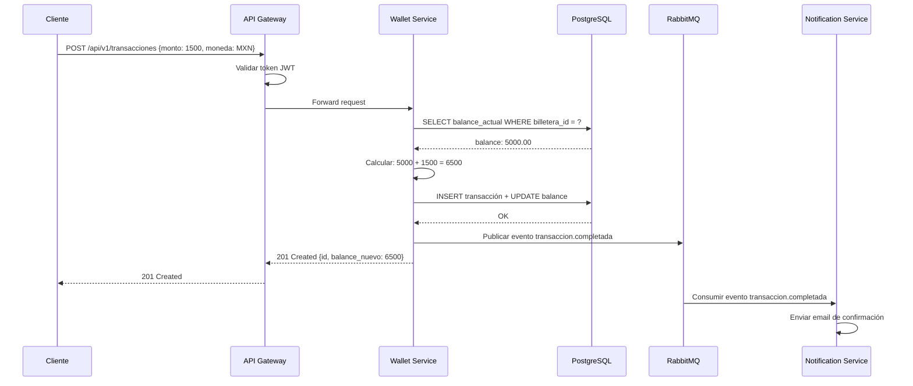

# PARTE 0: Infraestructura Base y Entorno de Desarrollo

> **Objetivo**: Configurar un entorno de desarrollo profesional, entender el ciclo
> HTTP y establecer las bases para un proyecto de microservicios fintech.
>
> **Duración estimada**: 8–12 horas
>
> **Resultado**: Un entorno verificado y una comprensión sólida de HTTP/JSON
> aplicada al dominio de procesamiento de transacciones.

---

## Índice

- [0.1 El Curso y la Plataforma PrestaFlow](#01-el-curso-y-la-plataforma-prestaflow)
- [0.2 HTTP: El Ciclo Petición/Respuesta](#02-http-el-ciclo-peticiónrespuesta)
- [0.3 JSON como Contrato entre Microservicios](#03-json-como-contrato-entre-microservicios)
- [0.4 Entorno de Desarrollo](#04-entorno-de-desarrollo)
- [0.5 Git, TDD y el Flujo de Trabajo](#05-git-tdd-y-el-flujo-de-trabajo)
- [Ejercicios de la Parte 0](#ejercicios-de-la-parte-0)

---

## 0.1 El Curso y la Plataforma PrestaFlow

### Bienvenido

Este curso te llevará desde cero hasta la construcción de un ecosistema completo
de microservicios fintech. No es un tutorial superficial: cada línea de código
tiene un comentario explicando el *por qué*, cada concepto se valida con tests,
y cada servicio se despliega con Docker y Kubernetes.

**PrestaFlow** es una plataforma de pagos y préstamos. El dominio incluye:

- Tarjetas de crédito y cuentas de usuarios
- Procesamiento de transacciones (depósitos, retiros, transferencias)
- Aprobación de préstamos con reglas de negocio
- Notificaciones asíncronas entre servicios

### Arquitectura Final del Curso

```
                        ┌─────────────────────────────────────────┐
                        │            PrestaFlow Ecosystem          │
                        └─────────────────────────────────────────┘

    ┌──────────┐     ┌──────────────┐     ┌──────────────┐
    │  API     │     │  wallet-     │     │  loan-       │
    │  Gateway │────▶│  service     │────▶│  service     │
    │ (Nginx)  │     │  (PHP 8.3)   │     │  (PHP 8.3)   │
    └──────────┘     └──────┬───────┘     └──────┬───────┘
                            │                     │
                    ┌───────▼───────┐     ┌───────▼───────┐
                    │  PostgreSQL   │     │  PostgreSQL   │
                    │  (wallet_db)  │     │  (loan_db)    │
                    └───────────────┘     └───────────────┘

                    ┌──────────────────────────────────────┐
                    │           RabbitMQ (Event Bus)        │
                    │  ┌──────────┐  ┌──────────────────┐  │
                    │  │ exchange │  │ queues:           │  │
                    │  │ prestflow│  │  transactions     │  │
                    │  │  .events │  │  loans            │  │
                    │  │          │  │  notifications    │  │
                    │  │          │  │  dead-letter       │  │
                    │  └──────────┘  └──────────────────┘  │
                    └──────────────────────────────────────┘

    ┌──────────────────────────────────────────────────────┐
    │              Observabilidad (Datadog APM)             │
    │  Agent → Traces → Metrics → Logs estructurados       │
    └──────────────────────────────────────────────────────┘
```

### Qué Construiremos Parte a Parte

```
Parte 0  Entorno + HTTP + Git/TDD mindset         → Herramientas, cero código
Parte 1  PHP moderno + primer micro-servicio       → wallet-service: core puro
Parte 2  Controllers Doctrine, Docker Compose       → wallet-service: HTTP + persistencia
Parte 3  Messenger + RabbitMQ + eventos             → loan-service nace
Parte 4  API Platform + seguridad JWT + Behat       → user/auth-service
Parte 5  Tracing, K8s, GitHub Actions CI/CD         → Producción completa
```

### Cómo Funciona el Aprendizaje

Cada lección sigue el mismo patrón:

1. **Concepto**: Explicación teórica concisa con diagramas
2. **Código completo**: Bloque funcional, línea por línea comentado
3. **Salida esperada**: Qué verás al ejecutar (logs, JSON, tests)
4. **Checkpoint**: Verificación de que todo funciona antes de avanzar

> **Regla de oro**: Nunca avances a la siguiente lección si el checkpoint
> actual no está verde. Cada parte se construye sobre la anterior.

---

## 0.2 HTTP: El Ciclo Petición/Respuesta

### ¿Qué es HTTP?

HTTP (HyperText Transfer Protocol) es el protocolo que utiliza la web. Cada
interacción entre un cliente (navegador, app móvil, otro microservicio) y un
servidor es un par **petición → respuesta**.

### Anatomía de una Petición HTTP

```
POST /api/v1/transacciones HTTP/1.1          ← Línea de método + ruta + versión
Host: localhost:8080                          ← Header: servidor destino
Content-Type: application/json                ← Header: tipo de contenido
Authorization: Bearer eyJhbGciOi...           ← Header: token de autenticación
Accept: application/json                      ← Header: qué formato acepto como respuesta

{                                             ← Body (cuerpo): datos enviados
  "monto": "1500.00",                        ← Monto como string (nunca float en fintech)
  "moneda": "MXN",                           ← Código ISO de moneda
  "tipo": "deposito",                        ← Tipo de transacción
  "idempotency_key": "abc-123-def"           ← Clave de idempotencia (crucial en pagos)
}
```

### Anatomía de una Respuesta HTTP

```
HTTP/1.1 201 Created                         ← Código de estado: 201 = creado exitosamente
Content-Type: application/json               ← Formato de la respuesta
X-Request-Id: req-789                        ← ID de rastreo para debugging
Date: Mon, 10 Sep 2026 15:30:00 GMT          ← Timestamp de la respuesta

{                                             ← Body: datos de la respuesta
  "id": "txn_a1b2c3d4e5",                    ← ID único de la transacción
  "estado": "completada",                     ← Estado actual
  "monto": "1500.00",                         ← Monto confirmado
  "moneda": "MXN",
  "creado_en": "2026-09-10T15:30:00Z",       ← Timestamp ISO 8601
  "deposito": {
    "billetera_id": "wallet_x1y2z3",          ← Billetera destino
    "balance_anterior": "5000.00",            ← Balance antes del depósito
    "balance_nuevo": "6500.00"                ← Balance después del depósito
  }
}
```

### Códigos de Estado HTTP que Usaremos

```
┌──────┬──────────────────────┬───────────────────────────────────────────────┐
│ Código │ Nombre               │ Cuándo se usa en PrestaFlow                  │
├──────┼──────────────────────┼───────────────────────────────────────────────┤
│ 200  │ OK                   │ GET exitoso, consulta de balance             │
│ 201  │ Created              │ POST exitoso, nueva transacción creada       │
│ 202  │ Accepted             │ Evento encolado para procesamiento async     │
│ 400  │ Bad Request          │ JSON malformado, campos obligatorios faltan  │
│ 401  │ Unauthorized         │ Token JWT faltante o expirado                │
│ 403  │ Forbidden            │ Token válido pero sin permisos               │
│ 404  │ Not Found            │ Billetera o transacción no existe            │
│ 409  │ Conflict             │ Transacción duplicada (idempotency_key)     │
│ 422  │ Unprocessable        │ Datos válidos pero regla de negocio falla    │
│ 429  │ Too Many Requests    │ Rate limiting: demasiadas peticiones        │
│ 500  │ Internal Server Error│ Error inesperado del servidor               │
│ 503  │ Service Unavailable  │ Servicio dependiente no disponible           │
└──────┴──────────────────────┴───────────────────────────────────────────────┘
```

### Práctica: Tu Primera Petición con curl

`curl` es la herramienta de línea de comandos para hacer peticiones HTTP.
Vamos a practicar con un servidor público de prueba:

```bash
# GET simple: consultar una lista de recursos
# -s = silent (sin barra de progreso)
# -H = header personalizado
curl -s -H "Accept: application/json" \
  https://jsonplaceholder.typicode.com/posts/1
```

**Salida esperada:**

```json
{
  "userId": 1,
  "id": 1,
  "title": "sunt aut facere repellat provident occaecati excepturi optio reprehenderit",
  "body": "quia et suscipit\nsuscipit recusandae consequuntur..."
}
```

```bash
# POST: enviar datos a un servidor
# -X POST = método HTTP POST
# -H "Content-Type: application/json" = Indicamos que enviamos JSON
# -d = data, el cuerpo de la petición
curl -s -X POST \
  -H "Content-Type: application/json" \
  -d '{"title": "Mi primera transacción", "body": "Depósito de prueba", "userId": 1}' \
  https://jsonplaceholder.typicode.com/posts
```

**Salida esperada:**

```json
{
  "title": "Mi primera transacción",
  "body": "Depósito de prueba",
  "userId": 1,
  "id": 101
}
```

```bash
# Ver headers de respuesta: -v (verbose) o -I (solo headers)
# -I muestra solo los headers sin el body
curl -s -I https://jsonplaceholder.typicode.com/posts/1
```

**Salida esperada:**

```
HTTP/1.1 200 OK
Date: Mon, 10 Sep 2026 15:30:00 GMT
Content-Type: application/json; charset=utf-8
Content-Length: 292
...
```

### Flujo Completo: ¿Qué Pasa Cuando Haces un POST?

```
┌─────────┐         ┌──────────┐         ┌──────────┐         ┌──────────┐
│ Cliente │         │  DNS     │         │  TCP/TLS │         │ Servidor │
│ (curl)  │         │          │         │          │         │  (PHP)   │
└────┬────┘         └────┬─────┘         └────┬─────┘         └────┬─────┘
     │                   │                    │                    │
     │  1. Resuelve      │                    │                    │
     │  "api.prestaflow" │                    │                    │
     │──────────────────▶│                    │                    │
     │                   │  2. Retorna IP     │                    │
     │◀──────────────────│                    │                    │
     │                   │                    │                    │
     │  3. Handshake TCP + TLS                │                    │
     │───────────────────────────────────────▶│                    │
     │◀───────────────────────────────────────│                    │
     │                   │                    │                    │
     │  4. POST /api/v1/transacciones         │                    │
     │  Host: api.prestaflow.com              │                    │
     │  Body: {"monto":"1500.00"...}          │                    │
     │────────────────────────────────────────────────────────────▶│
     │                   │                    │                    │
     │                   │                    │  5. PHP:            │
     │                   │                    │  Router → Controller│
     │                   │                    │  → Domain → DB     │
     │                   │                    │                    │
     │  6. HTTP 201 Created                  │                    │
     │  Body: {"id":"txn_abc"...}             │                    │
│◀────────────────────────────────────────────────────────────│
    │                   │                    │                    │
    ```

### Diagramas de Secuencia con Mermaid

Para el **Ejercicio 0.2** (y en las Partes 2 en adelante) modelarás flujos
entre servicios como *diagramas de secuencia*. Mermaid es la herramienta
estándar: escribes texto plano y obtienes el diagrama. Puedes probar en
https://mermaid.live.

**Estructura básica:**



- `sequenceDiagram` → declara el tipo de diagrama.
- `participant C as Cliente` → define un actor; `C` es su alias, `Cliente` la
  etiqueta que se muestra.
- `C->>S: mensaje` → petición síncrona (el emisor espera respuesta).
- `S-->>C: mensaje` → respuesta del receptor (flecha punteada).
- `alt condición` ... `else ...` ... `end` → rama condicional; se usa para
  modelar el manejo de errores. Si la condición no se cumple, `else` define
  el camino alternativo.

**Ejemplo con rama de error:**



> **Regla**: para que el Ejercicio 0.2 cuente, tu `sequenceDiagram` debe ser
> válido en https://mermaid.live (sin errores de sintaxis).

> **En las Partes 2 y 3**, veremos cómo Symfony maneja internamente los pasos
> 4–6 de este diagrama. Por ahora, lo importante es entender la *contract*:
> qué envías (request) y qué recibes (response).

---

## 0.3 JSON como Contrato entre Microservicios

### ¿Por qué JSON?

En arquitectura de microservicios, cada servicio es un mundo independiente.
Lo que los conecta son **contratos**: acuerdos sobre el formato de los datos
que intercambian. JSON es el formato estándar porque:

1. **Legible**: Humanos y máquinas lo entienden
2. **Universal**: PHP, Python, Go, Node.js — todos lo soportan
3. **Flexible**: Soporta objetos anidados, arrays, tipos mixtos
4. **Compacto**: Menos bytes que XML para la misma información

### Regla de Oro en Fintech: Los Montos Son Strings

NUNCA envíes montos monetarios como floats en JSON:

```json
{
  "monto": "1500.00",
  "moneda": "MXN"
}
```

**¿Por qué?** Porque los floats tienen precisión limitada:

```php
<?php
// ❌ MAL: Floats pierden precisión
var_dump(0.1 + 0.2);        // float(0.3) ← parece bien, pero...
var_dump(0.1 + 0.2 === 0.3); // bool(false) ← ¡NO ES IGUAL!
var_dump(0.1 + 0.2);        // float(0.30000000000000004) ← aquí está el problema

// ✅ BIEN: Strings + conversión explícita a integer (centavos)
$montoCentavos = (int) (1500.00 * 100); // 150000 centavos
// El dominio trabaja en centavos internamente, pero muestra en decimales
```

### Contrato JSON: Transacción de Depósito

Este es el contrato que nuestros servicios usarán para registrar depósitos.
Lo estudiaremos en detalle cuando construyamos el wallet-service en la Parte 1.

**Request (lo que envía el cliente):**

```json
{
  "monto": "1500.00",
  "moneda": "MXN",
  "tipo": "deposito",
  "billetera_id": "wallet_x1y2z3",
  "idempotency_key": "dep_unique_abc123",
  "metadata": {
    "origen": "transferencia_bancaria",
    "referencia": "REF-2026-001"
  }
}
```

**Response exitosa (201 Created):**

```json
{
  "id": "txn_a1b2c3d4e5",
  "estado": "completada",
  "monto": "1500.00",
  "moneda": "MXN",
  "tipo": "deposito",
  "billetera_id": "wallet_x1y2z3",
  "balance_anterior": "5000.00",
  "balance_nuevo": "6500.00",
  "creado_en": "2026-09-10T15:30:00Z",
  "procesado_en": "2026-09-10T15:30:01Z"
}
```

**Response de error (422 Unprocessable Entity):**

```json
{
  "error": {
    "codigo": "FONDOS_INSUFICIENTES",
    "mensaje": "Saldo insuficiente para completar la transacción",
    "detalle": {
      "monto_solicitado": "5000.00",
      "saldo_disponible": "3200.00",
      "déficit": "1800.00"
    }
  }
}
```

### Inspeccionar y Validar JSON con jq

Cuando pruebes un microservicio a mano, necesitas ver y validar los JSON que
devuelve. `jq` es la herramienta estándar para eso: filtra, extrae y valida
JSON desde la terminal. Vas a necesitarla en los Ejercicios 0.1 y 0.3.

**Instalación:**

```bash
# macOS
brew install jq

# Ubuntu/Debian (y WSL2)
sudo apt install jq

# Verificar
jq --version
```

**Extraer un campo:**

```bash
curl -s https://jsonplaceholder.typicode.com/users/1 | jq '.email'
# → "Sincere@april.biz"

# Campos anidados
curl -s https://jsonplaceholder.typicode.com/users/1 | jq '.address.city'
# → "Gwenborough"
```

**Salida sin comillas con `-r` (raw):**

```bash
curl -s https://jsonplaceholder.typicode.com/users/1 | jq -r '.email'
# → Sincere@april.biz  (sin comillas: útil para variables o comparaciones)
```

**Reestructurar la salida en un objeto propio:**

```bash
curl -s https://jsonplaceholder.typicode.com/users/1 | \
  jq '{nombre: .name, email: .email, ciudad: .address.city}'
```

**Validar que un JSON cumple el contrato:**

```bash
# ¿Existe la clave?
jq 'has("billetera_id")' transaccion-request.json     # → true

# ¿Qué tipo tiene un campo? Los montos DEBEN ser strings
jq '.monto | type' transaccion-request.json           # → "string" (nunca "number")

# ¿Cuántos caracteres o elementos?
jq '.moneda | length' transaccion-request.json        # → 3

# Validación completa: true = cumple, false = no cumple
jq 'has("monto") and has("moneda") and (.monto | type) == "string"' \
  transaccion-request.json                            # → true
```

> **`jq empty`** valida que el archivo sea JSON bien formado: si lo es no
> imprime nada y termina con exit code 0; si está malformado termina con
> exit code distinto de 0. Es el primer filtro de cualquier script de
> validación de contratos (lo usarás en el Ejercicio 0.3).

### Validación Automática: Escribir un Script bash

Los comandos sueltos de `jq` sirven para probar a mano, pero un contrato se
valida cientos de veces. La forma profesional es un **script**: un archivo
bash que aplica las reglas y termina con un *exit code* (código de salida)
que otros scripts o tu CI pueden interpretar. Eso es exactamente lo que pide
el Ejercicio 0.3.

**Paso 1 — Crear el archivo:**

```bash
cat > validar-contrato.sh << 'EOF'
#!/usr/bin/env bash
set -euo pipefail
EOF
```

- `cat > archivo << 'EOF'` (here-doc) escribe todo lo que sigue hasta la
  línea que contenga `EOF`. Las comillas de `'EOF'` evitan que bash
  interprete `$`, `$( )` o backticks mientras escribes el contenido.
- `#!/usr/bin/env bash` (shebang) marca el archivo como script de bash.
  Tras `chmod +x validar-contrato.sh` podrás ejecutarlo con `./validar-contrato.sh`
  (o siempre con `bash validar-contrato.sh`).
- `set -euo pipefail` hace el script a prueba de errores silenciosos:
  `-e` aborta ante el primer comando que falle, `-u` aborta si usas una
  variable sin definir, `-o pipefail` propaga los fallos de un pipeline.

**Paso 2 — Recibir el JSON (argumento o stdin):**

```bash
if [[ $# -eq 1 ]]; then
    FILE="$1"        # $1 = primer argumento: bash validar-contrato.sh archivo.json
else
    FILE=/dev/stdin  # sin argumento: lee lo que llegue por pipe: echo '{...}' | bash validar-contrato.sh
fi
```

> `$#` es el número de argumentos. Con `set -u`, leer `$1` sin haber pasado
> argumentos abortaría el script — por eso se comprueba `$#` primero.

**Paso 3 — Aplicar las reglas y acumular errores:**

```bash
ERRORS=()                        # array (lista) vacío

# ¿Es JSON bien formado? jq empty: exit 0 si lo es, distinto de 0 si no
if ! jq empty "$FILE" 2>/dev/null; then
    echo "CONTRATO INVÁLIDO: JSON malformado"
    exit 1
fi

# monto debe ser string (nunca number)
if [[ "$(jq -r '.monto | type' "$FILE")" != "string" ]]; then
    ERRORS+=("monto debe ser string, no $(jq -r '.monto | type' "$FILE")")
fi

# moneda debe tener exactamente 3 caracteres
if [[ "$(jq -r '.moneda | length' "$FILE")" -ne 3 ]]; then
    ERRORS+=("moneda debe tener exactamente 3 caracteres")
fi

# tipo debe ser uno de los valores permitidos
case "$(jq -r '.tipo' "$FILE")" in
    deposito|retiro|transferencia) ;;          # valores permitidos: OK
    *) ERRORS+=("tipo '$(jq -r '.tipo' "$FILE")' no es válido") ;;
esac

# idempotency_key no puede estar vacío
if [[ "$(jq -r '.idempotency_key | length' "$FILE")" -eq 0 ]]; then
    ERRORS+=("idempotency_key no puede estar vacío")
fi
```

- `ERRORS=()` crea un array vacío y `ERRORS+=("mensaje")` le agrega un
  elemento.
- `$(comando)` captura la salida de un comando en una variable o comparación.
- `[[ ... ]]` compara texto (`==`, `!=`) y `-eq`/`-ne` comparan números.
- `case "$x" in ... esac` compara contra varios valores; el patrón `*`
  captura *cualquier otro* valor.

**Paso 4 — Veredicto y exit code:**

```bash
if [[ ${#ERRORS[@]} -eq 0 ]]; then
    echo "CONTRATO VÁLIDO"
    exit 0
else
    echo "CONTRATO INVÁLIDO:"
    for err in "${ERRORS[@]}"; do
        echo "  - $err"
    done
    exit 1
fi
```

- `${#ERRORS[@]}` cuenta los errores acumulados.
- `for x in "${ERRORS[@]}"` recorre cada uno de ellos.
- `exit 0` = éxito, `exit 1` = fallo. Al ejecutar
  `bash validar-contrato.sh transaccion-request.json; echo $?` verás el exit
  code impreso tras la ejecución.

**Script completo** (es el mismo que sirve de solución de referencia para el
Ejercicio 0.3):

```bash
#!/usr/bin/env bash
# validar-contrato.sh — Valida el contrato JSON de una transacción
# Uso: bash validar-contrato.sh archivo.json   (o JSON por stdin)

set -euo pipefail

# Fuente del JSON: argumento o stdin
if [[ $# -eq 1 ]]; then
    FILE="$1"
    if [[ ! -f "$FILE" ]]; then
        echo "CONTRATO INVÁLIDO: Archivo no encontrado: $FILE"
        exit 1
    fi
else
    FILE=/dev/stdin
fi

# Verificar que es JSON bien formado
if ! jq empty "$FILE" 2>/dev/null; then
    echo "CONTRATO INVÁLIDO: JSON malformado"
    exit 1
fi

ERRORS=()

# Validar que monto sea string
MONTO_TYPE=$(jq -r '.monto | type' "$FILE")
if [[ "$MONTO_TYPE" != "string" ]]; then
    ERRORS+=("monto debe ser string, no $MONTO_TYPE")
fi

# Validar que monto tenga formato numérico positivo
MONTO_VAL=$(jq -r '.monto' "$FILE")
if ! echo "$MONTO_VAL" | grep -qE '^[0-9]+(\.[0-9]+)?$'; then
    ERRORS+=("monto '$MONTO_VAL' no tiene formato numérico válido")
fi

# Validar que moneda tenga 3 caracteres
MONEDA_LEN=$(jq -r '.moneda | length' "$FILE")
if [[ "$MONEDA_LEN" -ne 3 ]]; then
    ERRORS+=("moneda debe tener exactamente 3 caracteres (tiene $MONEDA_LEN)")
fi

# Validar tipo sea uno de los permitidos
TIPO=$(jq -r '.tipo' "$FILE")
case "$TIPO" in
    deposito|retiro|transferencia) ;; # OK
    *) ERRORS+=("tipo '$TIPO' no es válido (usar: deposito, retiro, transferencia)") ;;
esac

# Validar que idempotency_key no esté vacío
KEY_LEN=$(jq -r '.idempotency_key | length' "$FILE")
if [[ "$KEY_LEN" -eq 0 ]]; then
    ERRORS+=("idempotency_key no puede estar vacío")
fi

# Resultado
if [[ ${#ERRORS[@]} -eq 0 ]]; then
    echo "CONTRATO VÁLIDO"
    exit 0
else
    echo "CONTRATO INVÁLIDO:"
    for err in "${ERRORS[@]}"; do
        echo "  - $err"
    done
    exit 1
fi
```

**Salidas esperadas:**

```
$ bash validar-contrato.sh transaccion-request.json
CONTRATO VÁLIDO

$ echo '{"monto": 1500, "moneda": "MXN", "tipo": "deposito", "billetera_id": "w1", "idempotency_key": "k1"}' | bash validar-contrato.sh
CONTRATO INVÁLIDO:
  - monto debe ser string, no number
```

> En el Ejercicio 0.3 tendrás que escribir este script **tú mismo** a partir
> de estas piezas; la solución de referencia está ahí para comparar después.

### Idempotencia: Protección contra Duplicados

En sistemas distribuidos, una petición puede llegar al servidor **más de una
vez** (timeout de red, reintento automático, etc.). Sin idempotencia, un
cliente que reintenta un depósito de $1500 podría generar **dos** depósitos.

La solución es el **idempotency_key**: un identificador único que el cliente
genera y envía con cada petición. El servidor verifica:

```
Cliente                           Servidor
  │                                  │
  │ POST /deposito                   │
  │ idempotency_key: "abc-123"       │
  │ monto: 1500                      │
  │─────────────────────────────────▶│
  │                                  │ ¿Ya procesé "abc-123"?
  │                                  │   NO → Procesar, guardar resultado
  │ 201 Created                      │   SÍ  → Retornar resultado guardado
  │◀─────────────────────────────────│
  │                                  │
  │ POST /deposito  (reintento)      │
  │ idempotency_key: "abc-123"       │
  │ monto: 1500                      │
  │─────────────────────────────────▶│
  │                                  │ ¿Ya procesé "abc-123"?
  │ 201 Created                      │   SÍ → Retornar mismo resultado
  │◀─────────────────────────────────│     (sin procesar de nuevo)
```

> **Implementaremos idempotencia** en la Parte 3 cuando configuremos
> RabbitMQ con symfony/messenger y procesamiento exactly-once.

---

## 0.4 Entorno de Desarrollo

### Paso 1: Verificar PHP 8.3+

```bash
# Verificar versión de PHP instalada
php --version
```

**Salida esperada:**

```
PHP 8.3.12 (cli) (built: Sep  5 2026 14:21:03) (NTS)
Copyright (c) The PHP Group
Zend Engine v4.3.12, Copyright (c) Zend Technologies
    with Zend OPcache v8.3.12, Copyright (c), by Zend Technologies
    with Xdebug v3.3.2, Copyright (c) 2002-2024, by Derick Rethans
```

> **Si no tienes PHP 8.3+**, instálalo:
>
> - **macOS**: `brew install php@8.3`
> - **Ubuntu/Debian**: `sudo apt install php8.3 php8.3-cli php8.3-mbstring php8.3-xml php8.3-curl php8.3-zip`
> - **Windows**: Descarga desde https://windows.php.net/download/ o usa WSL2 + Ubuntu

### Paso 2: Verificar Composer

```bash
# Verificar Composer (gestor de dependencias PHP)
composer --version
```

**Salida esperada:**

```
Composer version 2.7.8 2024-06-11 17:19:33
```

```bash
# Si no tienes Composer, instálalo con el instalador oficial
curl -sS https://getcomposer.org/installer | php
# Mover el phar al PATH global
sudo mv composer.phar /usr/local/bin/composer
```

### Paso 3: Symfony CLI

```bash
# Verificar Symfony CLI
symfony version
```

**Salida esperada:**

```
Symfony CLI 7.2.3 (v7.2.3)
```

```bash
# Instalar Symfony CLI
# macOS/Linux:
curl -sS https://get.symfony.com/cli/installer | bash
# Agregar al PATH (añadir a ~/.bashrc o ~/.zshrc)
export PATH="$HOME/.symfony5/bin:$PATH"
```

### Paso 4: Crear el Directorio del Curso

```bash
# Crear directorio raíz del curso
mkdir -p ~/fsc-php-curso
cd ~/fsc-php-curso

# Inicializar git
git init
git branch -M main

# Crear estructura del monorepo
mkdir -p parte0/ejercicios
mkdir -p parte0/scripts
mkdir -p parte1/ejercicios
mkdir -p parte1/soluciones
mkdir -p docs/images

# Primer commit: esqueleto del monorepo
touch .editorconfig
echo "# FSC-PHP: Microservicios Fintech" > README.md
git add .
git commit -m "chore: inicializar monorepo del curso"
```

**Salida esperada:**

```
[main (root-commit) a1b2c3d] chore: inicializar monorepo del curso
 4 files changed, 1 insertion(+)
 create mode 100644 .editorconfig
 create mode 100644 README.md
```

### Paso 5: Docker (para la Lección 0.2)

```bash
# Verificar Docker
docker --version
docker compose version
```

**Salida esperada:**

```
Docker version 27.1.1, build 100c701
Docker Compose version v2.29.1
```

### Paso 6: Ejecutar el Verificador de Entorno

El curso incluye un script que verifica todo automáticamente:

```bash
# Desde la raíz del monorepo
bash parte0/scripts/doctor.sh
```

**Salida esperada:**

```
╔══════════════════════════════════════════════════════╗
║   FSC-PHP — Verificador de Entorno de Desarrollo    ║
╚══════════════════════════════════════════════════════╝

  ✓ PHP: 8.3.12 (cumple requisito ≥8.3)
  ✓ Composer: 2.7.8 (cumple requisito ≥2.7)
  ✓ Symfony CLI: 7.2.3
  ✓ Git: 2.43.0 (user: Juan Laguna <juan@ejemplo.com>)
  ✓ Docker: 27.1.1 (daemon corriendo)
  ✓ Docker Compose: 2.29.1

═══════════════════════════════════════════════════════
  Resumen: 5 verificados | 1 advertencias | 0 fallidos
═══════════════════════════════════════════════════════
  Veredicto: READY — Tu entorno está listo para el curso.

--- Salida JSON ---
{
  "php": { "installed": true, "version": "8.3.12", "meets_requirement": true },
  "composer": { "installed": true, "version": "2.7.8", "meets_requirement": true },
  "symfony_cli": { "installed": true, "version": "7.2.3" },
  "git": { "installed": true, "version": "2.43.0", "configured": true },
  "docker": { "installed": true, "version": "27.1.1", "running": true },
  "docker_compose": { "installed": true, "version": "2.29.1" },
  "verdict": "READY"
}
```

### Checkpoint 0.4 ✓

Tu entorno debe mostrar `verdict: "READY"` en el script doctor.sh.
Si tienes errores, revisa las secciones de instalación de cada herramienta.

---

## 0.5 Git, TDD y el Flujo de Trabajo del Curso

### Git: El Historial Cuenta una Historia

En este curso, los commits de Git no son un formalismo. Son una **documentación
viva** de cómo evoluciona el código. Usaremos [Conventional Commits](https://www.conventionalcommits.org/):

```
tipo(alcance): descripción corta en imperativo

Tipos:
  feat     → Nueva funcionalidad (feature)
  fix      → Corrección de un bug
  test     → Agregar o modificar tests (sin cambiar comportamiento)
  refactor → Reestructurar código (sin cambiar comportamiento)
  chore    → Tareas de mantenimiento (deps, config, CI)
  docs     → Documentación
  style    → Formato (no afecta lógica)
  ci       → Integración continua
```

**Ejemplo de historial del curso:**

```
a1b2c3d  chore: inicializar monorepo del curso
d4e5f6a  feat(parte1): crear SaludController con GET /salud
g7h8i9j  test(parte1): agregar test funcional de SaludController
k0l1m2n  feat(parte1): implementar objeto de valor Dinero
o3p4q5r  test(parte1): agregar tests unitarios de Dinero con DataProviders
s6t7u8v  feat(parte1): implementar aggregate Billetera
w9x0y1z  test(parte1): agregar test de arquitectura DominioPuro
a2b3c4d  chore(parte1): configurar PHPStan nivel 6 + CS-Fixer
```

### TDD: Red → Green → Refactor

TDD (Test-Driven Development) es el ciclo de:

```
    ┌───────────┐
    │   RED     │  ← Escribes un TEST que FALLA
    │ (fallo)   │     (porque la funcionalidad no existe aún)
    └─────┬─────┘
          │
          ▼
    ┌───────────┐
    │  GREEN    │  ← Escribes MÍNIMO código para que pase
    │ (éxito)   │     (no más, no menos — solo lo necesario)
    └─────┬─────┘
          │
          ▼
    ┌───────────┐
    │ REFACTOR  │  ← Limpias el código sin cambiar comportamiento
    │ (limpieza)│     (el test sigue pasando)
    └─────┬─────┘
          │
          ▼
      Siguiente
      funcionalidad
```

### Ejemplo: Primer Test con PHPUnit

Veamos el ciclo TDD completo con un ejemplo simple. Crearemos una función
que valida si un monto es positivo:

```php
<?php
// tests/Unit/MontoTest.php

declare(strict_types=1);

// Importamos la clase TestCase de PHPUnit
// Esta clase provee los métodos de aserción (assert*)
use PHPUnit\Framework\TestCase;

// PHPUnit 11 usa atributos PHP 8 en lugar de anotaciones docblock.
// #[Test] marca un método como test ejecutable.
// #[CoversClass] indica qué clase está siendo testeada (para cobertura).
// PHPUnit no ejecuta métodos sin #[Test].
final class MontoTest extends TestCase
{
    // #[Test] → PHPUnit ejecutará este método como un caso de prueba
    #[Test]
    // #[DataProvider('montonPositivo')] → Vincula un DataProvider que
    // provee múltiples conjuntos de datos para el mismo test.
    // El método 'montonPositivo' retorna un array de arrays.
    #[DataProvider('montonPositivo')]
    // El método recibe un string (el monto) y un entero (centavos esperados).
    // Si el monto no es un número válido, PHPUnit lanzará error antes del assert.
    public function test_monto_valido_se_convierte_a_centavos(string $monto, int $centavosEsperados): void
    {
        // Llamamos a la función que vamos a construir (TDD: primero el test)
        // Convierte un monto string a centavos integer
        $resultado = montoACentavos($monto);

        // assertEquals compara el resultado esperado con el obtenido.
        // Si no son iguales, PHPUnit muestra ambos valores y falla el test.
        $this->assertSame($centavosEsperados, $resultado);
    }

    // DataProvider: retorna un array de arrays.
    // Cada sub-array = [monto_input, centavos_esperados]
    // PHPUnit ejecuta el test UNA VEZ por cada sub-array.
    // Esto reemplaza los test methods duplicados: test_monto_100, test_monto_50, etc.
    public static function montonPositivo(): array
    {
        return [
            // [input_monto, centavos_esperados]
            // Un dólar = 100 centavos
            ['1.00', 100],
            // Quinientos pesos = 50000 centavos
            ['500.00', 50000],
            // Un centavo (caso borde mínimo)
            ['0.01', 1],
            // Monto sin decimales
            ['10', 1000],
        ];
    }

    // Test que verifica el comportamiento ante montos inválidos.
    // PHPUnit provee la aserciónexpectException() que VALIDA que se lance
    // una excepción específica. Si NO se lanza, el test FALLA.
    #[Test]
    public function test_monto_negativo_lanza_excepcion(): void
    {
        // Indicamos que esperamos esta excepción específica
        // Si la función NO lanza la excepción → test FALLA
        // Si lanza OTRA excepción → test FALLA
        // Si lanza esta excepción → test PASA
        $this->expectException(\InvalidArgumentException::class);

        montoACentavos('-50.00');
    }
}
```

**Salida al ejecutar (con el código implementado):**

```bash
$ ./vendor/bin/phpunit tests/Unit/MontoTest.php
```

```
PHPUnit 11.3.0 by Sebastian Bergmann and contributors.

...                                                                 3 / 3 (100%)

Time: 00:00.012, Memory: 6.14 MB

OK (3 tests, 4 assertions)
```

### Ejemplo: Código Implementado (después de TDD)

```php
<?php
// src/Domain/Monto.php

declare(strict_types=1);

/**
 * Convierte un monto en formato decimal (string) a centavos (integer).
 *
 * ¿Por qué centavos? Porque los floats son imprecisos en PHP:
 *   0.1 + 0.2 = 0.30000000000000004 (¡no es 0.3!)
 *
 * Trabajar en centavos (enteros) garantiza precisión exacta.
 * Este patrón es estándar en toda la industria fintech.
 *
 * @param string $monto Monto en formato decimal, ej: "1500.00"
 *
 * @return int Monto en centavos, ej: 150000
 *
 * @throws \InvalidArgumentException Si el monto no es un número válido o es negativo
 */
function montoACentavos(string $monto): int
{
    // Verificar que el monto tenga un formato decimal válido.
    // filter_var con FILTER_VALIDATE_FLOAT valida que sea un número flotante.
    // Si no lo es, retorna false (que no es int, por eso !== false).
    $valor = filter_var($monto, FILTER_VALIDATE_FLOAT);

    // Validación defensiva: si filter_var retorna false, el input es inválido.
    // Lanazmos la excepción con un mensaje descriptivo para debugging.
    if ($valor === false) {
        throw new \InvalidArgumentException(
            "Monto inválido: '{$monto}'. Se esperaba un número decimal."
        );
    }

    // Validar que el monto no sea negativo.
    // En finanzas, montos negativos tienen un significado diferente (cargo vs abono).
    // Esta función solo acepta montos positivos para depósitos.
    if ($valor < 0) {
        throw new \InvalidArgumentException(
            "El monto no puede ser negativo: '{$monto}'"
        );
    }

    // Multiplicar por 100 para convertir decimales a centavos.
    // round() evita errores de punto flotante: 1.005 * 100 = 100.4999... → 100
    // PHP_INT_MAX = 9223372036854775807, así que enteros hasta ~92 billones de centavos
    return (int) round($valor * 100);
}
```

**Salida al ejecutar:**

```bash
$ php -r "
require 'src/Domain/Monto.php';
echo montoACentavos('1500.00') . PHP_EOL;  // 150000
echo montoACentavos('0.01') . PHP_EOL;     // 1
echo montoACentavos('99.99') . PHP_EOL;    // 9999
"
```

```
150000
1
9999
```

### Checkpoint 0.5 ✓

Antes de avanzar a la Parte 1, deberías tener:

```
~/fsc-php-curso/
├── .editorconfig
├── README.md
└── parte0/
    ├── README.md    ← Este archivo
    ├── ejercicios/
    │   ├── 0.1-http-requests.md
    │   ├── 0.2-sequence-diagram.md
    │   ├── 0.3-json-contract.md
    │   ├── 0.4-entorno-verificado.md
    │   └── 0.5-git-workflow.md
    └── scripts/
        └── doctor.sh
```

---

## Ejercicios de la Parte 0

Los ejercicios consolidan lo aprendido. Cada uno tiene un entregable concreto.

---

### Ejercicio 0.1: Practicar Peticiones HTTP

**Objetivo**: Familiarizarte con curl y los métodos HTTP.

**Instrucciones**:

1. Realiza un GET a `https://jsonplaceholder.typicode.com/posts` y guarda la
   respuesta en un archivo `respuesta-get.json`.

2. Realiza un POST al mismo endpoint con estos datos:

```json
{
  "title": "Depósito inicial",
  "body": "Primera transacción de mi billetera",
  "userId": 42
}
```

3. Guarda la respuesta en `respuesta-post.json`.

4. Realiza un GET a `https://jsonplaceholder.typicode.com/users/1` y extrae
   solo el campo `email` usando `jq` (instalar con `apt install jq` o
   `brew install jq`).

**Entregable**: Archivos `respuesta-get.json` y `respuesta-post.json` +
comando con `jq` que extrae el email.

**Verificación**:

```bash
# El GET debe retornar 100 posts
cat respuesta-get.json | python3 -c "import json,sys; print(len(json.load(sys.stdin)))"
# Salida: 100

# El POST debe retornar id=101
cat respuesta-post.json | python3 -c "import json,sys; print(json.load(sys.stdin)['id'])"
# Salida: 101

# El jq debe extraer el email
cat users.json | jq '.email'
# Salida: "Sincere@april.biz"
```

---

### Ejercicio 0.2: Diagrama de Secuencia de un Depósito

**Objetivo**: Visualizar el flujo de una transacción entre microservicios.

**Instrucciones**:

Usando [Mermaid](https://mermaid.live) o papel, crea un diagrama de secuencia
que muestre el flujo de un depósito de $1500 MXN:

**Actores**: Cliente → API Gateway → Wallet Service → PostgreSQL → RabbitMQ → Notification Service

**Pasos del flujo**:

1. Cliente envía POST /api/v1/transacciones con monto 1500 MXN
2. API Gateway valida el token JWT
3. Wallet Service verifica saldo actual
4. Wallet Service calcula nuevo balance
5. Wallet Service guarda la transacción en PostgreSQL
6. Wallet Service publica evento "transaccion.completada" en RabbitMQ
7. Notification Service consume el evento
8. Notification Service envía email de confirmación
9. API Gateway retorna 201 Created al cliente

**Entregable**: Archivo `docs/images/diagrama-deposito.mmd` con el Mermaid code.



**Verificación**: El diagrama debe ser válido en https://mermaid.live (sin errores de sintaxis).

---

### Ejercicio 0.3: Validar un Contrato JSON

**Objetivo**: Practicar la validación de contratos entre servicios.

**Instrucciones**:

1. Descarga e instala `jq` si no lo tienes:

```bash
# macOS
brew install jq

# Ubuntu/Debian
sudo apt install jq

# Windows (WSL2)
sudo apt install jq
```

2. Crea un archivo `transaccion-request.json` con este contenido:

```json
{
  "monto": "1500.00",
  "moneda": "MXN",
  "tipo": "deposito",
  "billetera_id": "wallet_x1y2z3",
  "idempotency_key": "dep_unique_abc123"
}
```

3. Escribe un script `validar-contrato.sh` que use `jq` para verificar:

   a. Que `monto` sea un string (no un número)
   b. Que `moneda` tenga exactamente 3 caracteres
   c. Que `tipo` sea uno de: `deposito`, `retiro`, `transferencia`
   d. Que `idempotency_key` no esté vacío

4. El script debe imprimir `CONTRATO VÁLIDO` o `CONTRATO INVÁLIDO: [razón]`.

**Entregable**: Archivo `validar-contrato.sh` ejecutable.

**Verificación**:

```bash
# Debe imprimir CONTRATO VÁLIDO
bash validar-contrato.sh transaccion-request.json

# Debe imprimir error por monto inválido
echo '{"monto": 1500, "moneda": "MXN", "tipo": "deposito", "billetera_id": "w1", "idempotency_key": "k1"}' | bash validar-contrato.sh /dev/stdin
# Salida: CONTRATO INVÁLIDO: monto debe ser string, no number
```

---

### Ejercicio 0.4: Verificar tu Entorno

**Objetivo**: Asegurar que tu entorno está correctamente configurado.

**Instrucciones**:

1. Ejecuta el verificador de entorno:

```bash
bash parte0/scripts/doctor.sh
```

2. Si el veredicto es `READY`, toma una captura de pantalla de la salida.

3. Si el veredicto es `NOT READY`, corrige los problemas e intenta de nuevo.

**Entregable**: Captura de pantalla o copia del JSON de salida con `verdict: "READY"`.

**Verificación**: El JSON debe tener `"verdict": "READY"`.

---

### Ejercicio 0.5: Flujo de Trabajo con Git

**Objetivo**: Practicar Conventional Commits y el flujo de trabajo del curso.

**Instrucciones**:

1. Crea un directorio llamado `mi-primer-repo` e inicialízalo con Git:

```bash
mkdir mi-primer-repo && cd mi-primer-repo
git init
git branch -M main
```

2. Crea un archivo `hola.txt` con el contenido "Hola PrestaFlow" y haz commit:

```bash
echo "Hola PrestaFlow" > hola.txt
git add hola.txt
git commit -m "docs: crear archivo de bienvenida"
```

3. Crea un archivo `suma.php` con una función que sume dos números:

```php
<?php
// suma.php
function sumar(int $a, int $b): int {
    return $a + $b;
}

echo sumar(2, 3) . PHP_EOL;
```

4. Haz commit con el tipo adecuado.

5. Crea un archivo `test-suma.php` que verifique que `sumar(2, 3) === 5`:

```php
<?php
// test-suma.php
require 'suma.php';

$resultado = sumar(2, 3);
$esperado = 5;

if ($resultado === $esperado) {
    echo "✓ Test pasó: sumar(2, 3) = {$resultado}" . PHP_EOL;
    exit(0);
} else {
    echo "✗ Test falló: esperaba {$esperado}, obtuve {$resultado}" . PHP_EOL;
    exit(1);
}
```

5. Ejecuta el test y haz commit con el tipo `test`.

6. Revisa el historial con `git log --oneline`.

**Entregable**: Historial de Git con al menos 3 commits con mensajes Convencionales.

**Verificación**:

```bash
# El test debe pasar
php test-suma.php
# Salida: ✓ Test pasó: sumar(2, 3) = 5

# El log debe mostrar commits convencionales
git log --oneline
# Salida ejemplo:
# b2c3d4e test: agregar test de la función sumar
# a1b2c3d feat: crear función sumar
# f0e1d2c docs: crear archivo de bienvenida
```

---

## Siguiente Paso

Una vez completados los ejercicios de la Parte 0, avanza a la **Parte 1: PHP 8.2+ Moderno, POO Avanzada y Fundamentos** donde construiremos el primer microservicio del ecosistema PrestaFlow.
