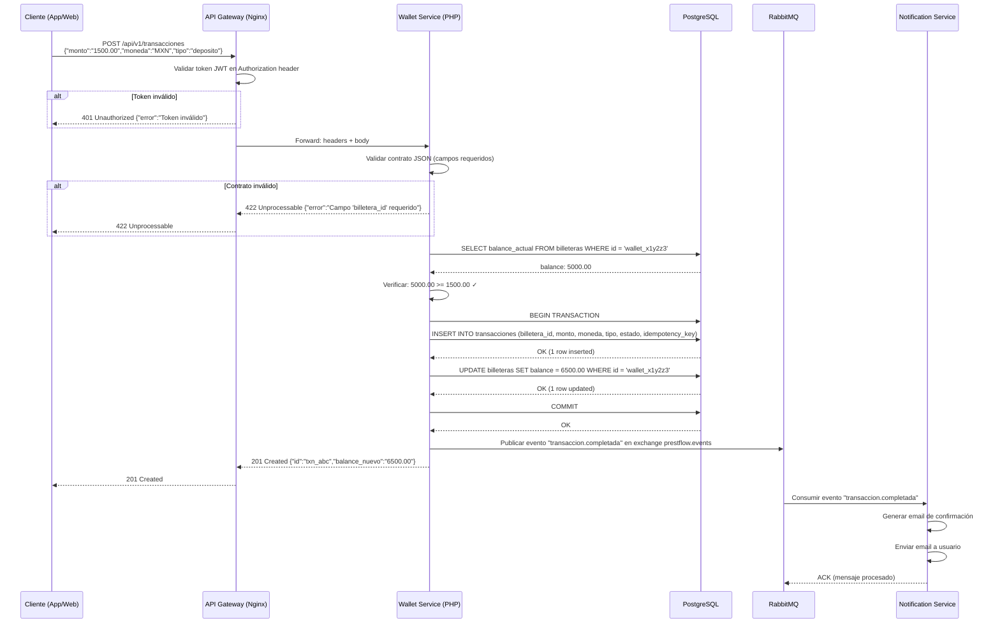

# Ejercicio 0.2: Diagrama de Secuencia de un Depósito

## Objetivo

Visualizar el flujo completo de una transacción de depósito entre microservicios,
identificando las responsabilidades de cada componente.

## Contexto

En PrestaFlow, un depósito toca 4 componentes: el cliente, el gateway, el
servicio de billeteras y el bus de eventos. Antes de escribir código,
debes entender este flujo.

## Instrucciones

### Opción A: Mermaid Live Editor

1. Ve a https://mermaid.live
2. Copia el siguiente código y pégalo en el editor:

3. Exporta como PNG o SVG.

### Opción B: Diagrama en Papel

Si prefieres dibujar a mano:

1. Dibuja 6 columnas: Cliente, API Gateway, Wallet Service, PostgreSQL, RabbitMQ, Notification Service
2. Traza flechas horizontales entre ellos con los mensajes
3. Usa notas al pie para indicar los códigos HTTP

## Entregable

Archivo `docs/images/diagrama-deposito.mmd` con el código Mermaid.

## Puntos

| Criterio | Puntos |
|---|---|
| Incluye todos los 6 participantes | 1 |
| Muestra validación JWT en el gateway | 1 |
| Muestra la transacción SQL (BEGIN/COMMIT) | 1 |
| Muestra publicación del evento en RabbitMQ | 1 |
| Diagrama es válido en mermaid.live | 1 |
| **Total** | **5** |
