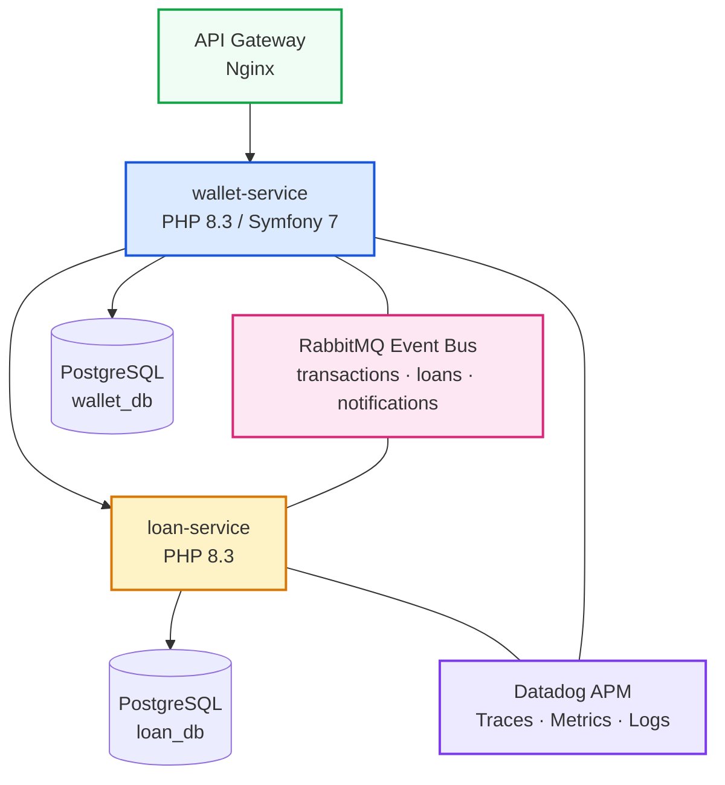
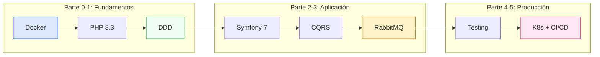

  <h1>🚀 FSC-PHP · PrestaFlow</h1>
  
Curso completo de PHP 8.3 + Symfony 7.4. De 0 a producción: Docker, DDD, CQRS, Event Sourcing, RabbitMQ, testing profesional, Kubernetes y CI/CD.

  
<strong>6 partes</strong> · <strong>42 ejercicios</strong> · <strong>292 puntos</strong>

## Plataforma PrestaFlow

A lo largo de este curso construimos **PrestaFlow**, una plataforma de pagos y
préstamos compuesta por múltiples microservicios fintech. Cada parte añade
capas de complejidad real sobre el mismo proyecto.

## Stack tecnológico

| Componente | Tecnología | Versión |
|---|---|---|
| Runtime | PHP | 8.3+ |
| Framework | Symfony | 7.4 LTS |
| Base de datos | PostgreSQL | 16 |
| Mensajería | RabbitMQ | 3.13 |
| Testing | PHPUnit 11 + Behat + Infection | — |
| Containers | Docker + Compose | 24+ |
| Orquestación | Kubernetes (Kind) | 1.30+ |
| CI/CD | GitHub Actions | — |
| Observabilidad | Datadog APM | Agent 7.x |

---

## El recorrido del curso

  <h3><a href="/parte0/">Parte 0 — Infraestructura Base y Entorno de Desarrollo</a> 27 pts</h3>
  
Docker, Docker Compose, estructura del monorepo, Datadog APM local, el ciclo HTTP completo desde curl hasta PHP.

  
<em>Resultado: un entorno verificado y una comprensión sólida de HTTP/JSON aplicada al dominio fintech.</em>

  
<a href="/parte0/">Ver ejercicios →</a>

  <h3><a href="/parte1/">Parte 1 — PHP 8.3 Moderno, POO y DDD</a> 57 pts</h3>
  
Enums, Value Objects inmutables (Dinero, Moneda), dominio rico, SOLID aplicado, tests unitarios de dominio puro.

  
<em>Resultado: un kernel de dominio con Billetera, Dinero y Movimiento — sin framework, sin BD.</em>

  
<a href="/parte1/">Ver ejercicios →</a>

  <h3><a href="/parte2/">Parte 2 — Symfony y Arquitectura Hexagonal</a> 52 pts</h3>
  
Symfony 7.4, Doctrine ORM, migraciones, API REST, servicios de aplicación, arquitectura hexagonal, tests de integración.

  
<em>Resultado: una API REST de billeteras con CRUD, persistencia y tests funcional/integración.</em>

  
<a href="/parte2/">Ver ejercicios →</a>

  <h3><a href="/parte3/">Parte 3 — CQRS y Event-Driven Architecture</a> 52 pts</h3>
  
Command/Query bus, handlers, RabbitMQ, topología de colas, eventos, idempotencia, loan-service separado.

  
<em>Resultado: comunicación async entre wallet y loan-service con eventos y msg idempotencia.</em>

  
<a href="/parte3/">Ver ejercicios →</a>

  <h3><a href="/parte4/">Parte 4 — Testing Profesional</a> 52 pts</h3>
  
Pirámide de testing, PHPUnit 11 (data providers, mocks), Behat + Gherkin en español, cobertura PCOV, Infection (mutational testing).

  
<em>Resultado: suite completa con tests unitarios, BDD, cobertura 100% en dominio y MSI 85%.</em>

  
<a href="/parte4/">Ver ejercicios →</a>

  <h3><a href="/parte5/">Parte 5 — Observabilidad, Kubernetes y CI/CD</a> 52 pts</h3>
  
Logs estructurados, Datadog APM spans personalizados, Docker multi-stage, Kubernetes (Deployment, Service, ConfigMap, HPA), GitHub Actions CI/CD.

  
<em>Resultado: PrestaFlow desplegado y autoescalable, con pipeline automática.</em>

  
<a href="/parte5/">Ver ejercicios →</a>

---

## Stack visual del curso

