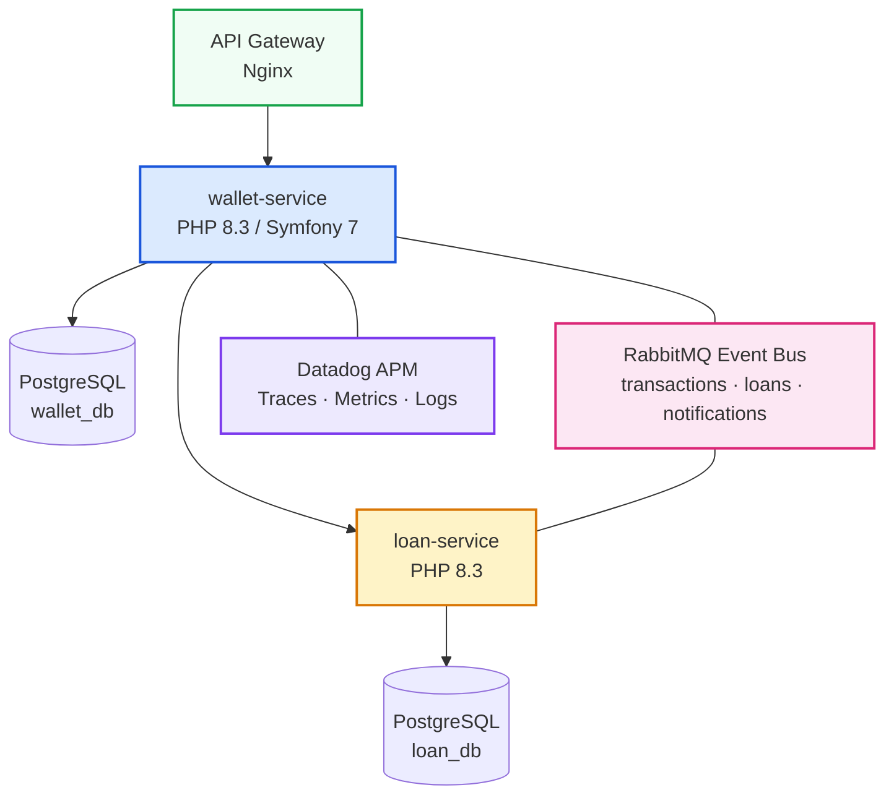

### Bienvenido

Este curso te llevará desde cero hasta la construcción de un ecosistema completo
de microservicios fintech. No es un tutorial superficial: cada línea de código
tiene un comentario explicando el *por qué*, cada concepto se valida con tests,
y cada servicio se despliega con Docker y Kubernetes.

**PrestaFlow** es una plataforma de pagos y préstamos. El dominio incluye:

- Tarjetas de crédito y cuentas de usuarios
- Procesamiento de transacciones (depósitos, retiros, transferencias)
- Aprobación de préstamos con reglas de negocio
- Notificaciones asíncronas entre servicios

### Arquitectura Final del Curso



### Qué Construiremos Parte a Parte

```
Parte 0  Entorno + HTTP + Git/TDD mindset         → Herramientas, cero código
Parte 1  PHP moderno + primer micro-servicio       → wallet-service: core puro
Parte 2  Controllers Doctrine, Docker Compose       → wallet-service: HTTP + persistencia
Parte 3  Messenger + RabbitMQ + eventos             → loan-service nace
Parte 4  API Platform + seguridad JWT + Behat       → user/auth-service
Parte 5  Tracing, K8s, GitHub Actions CI/CD         → Producción completa
```

### Cómo Funciona el Aprendizaje

Cada lección sigue el mismo patrón:

1. **Concepto**: Explicación teórica concisa con diagramas
2. **Código completo**: Bloque funcional, línea por línea comentado
3. **Salida esperada**: Qué verás al ejecutar (logs, JSON, tests)
4. **Checkpoint**: Verificación de que todo funciona antes de avanzar

> **Regla de oro**: Nunca avances a la siguiente lección si el checkpoint
> actual no está verde. Cada parte se construye sobre la anterior.

---
