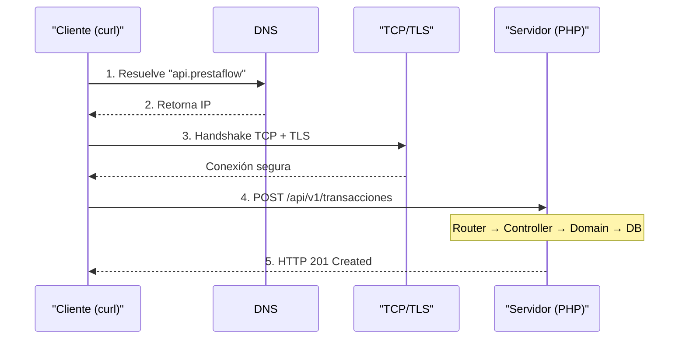
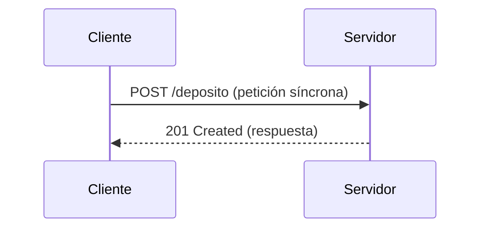
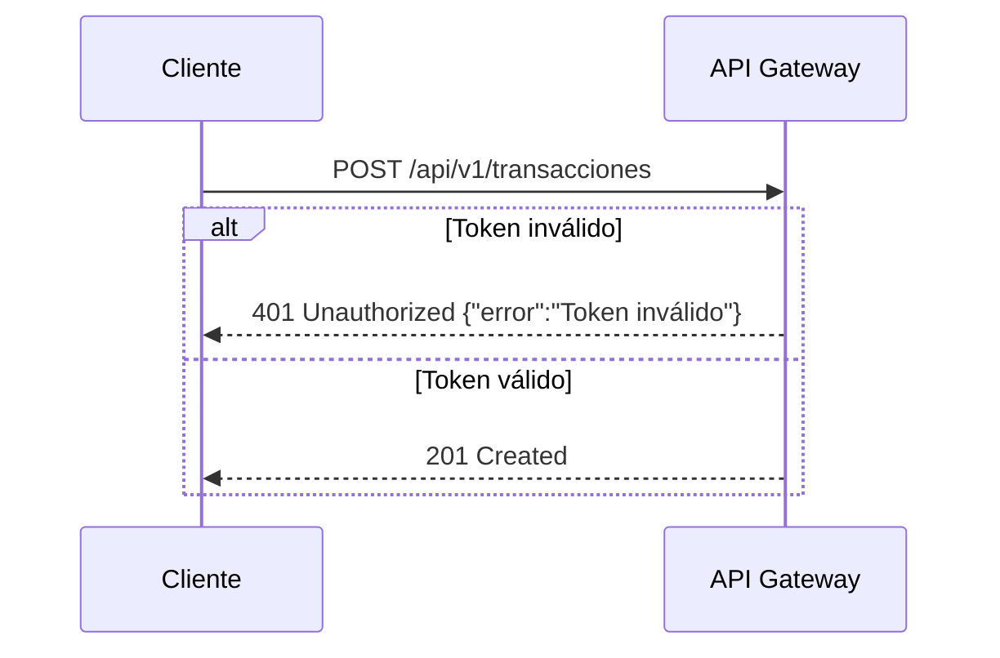

### ¿Qué es HTTP?

HTTP (HyperText Transfer Protocol) es el protocolo que utiliza la web. Cada
interacción entre un cliente (navegador, app móvil, otro microservicio) y un
servidor es un par **petición → respuesta**.

### Anatomía de una Petición HTTP

```
POST /api/v1/transacciones HTTP/1.1          ← Línea de método + ruta + versión
Host: localhost:8080                          ← Header: servidor destino
Content-Type: application/json                ← Header: tipo de contenido
Authorization: Bearer eyJhbGciOi...           ← Header: token de autenticación
Accept: application/json                      ← Header: qué formato acepto como respuesta

{                                             ← Body (cuerpo): datos enviados
  "monto": "1500.00",                        ← Monto como string (nunca float en fintech)
  "moneda": "MXN",                           ← Código ISO de moneda
  "tipo": "deposito",                        ← Tipo de transacción
  "idempotency_key": "abc-123-def"           ← Clave de idempotencia (crucial en pagos)
}
```

### Anatomía de una Respuesta HTTP

```
HTTP/1.1 201 Created                         ← Código de estado: 201 = creado exitosamente
Content-Type: application/json               ← Formato de la respuesta
X-Request-Id: req-789                        ← ID de rastreo para debugging
Date: Mon, 10 Sep 2026 15:30:00 GMT          ← Timestamp de la respuesta

{                                             ← Body: datos de la respuesta
  "id": "txn_a1b2c3d4e5",                    ← ID único de la transacción
  "estado": "completada",                     ← Estado actual
  "monto": "1500.00",                         ← Monto confirmado
  "moneda": "MXN",
  "creado_en": "2026-09-10T15:30:00Z",       ← Timestamp ISO 8601
  "deposito": {
    "billetera_id": "wallet_x1y2z3",          ← Billetera destino
    "balance_anterior": "5000.00",            ← Balance antes del depósito
    "balance_nuevo": "6500.00"                ← Balance después del depósito
  }
}
```

### Códigos de Estado HTTP que Usaremos

```
┌──────┬──────────────────────┬───────────────────────────────────────────────┐
│ Código │ Nombre               │ Cuándo se usa en PrestaFlow                  │
├──────┼──────────────────────┼───────────────────────────────────────────────┤
│ 200  │ OK                   │ GET exitoso, consulta de balance             │
│ 201  │ Created              │ POST exitoso, nueva transacción creada       │
│ 202  │ Accepted             │ Evento encolado para procesamiento async     │
│ 400  │ Bad Request          │ JSON malformado, campos obligatorios faltan  │
│ 401  │ Unauthorized         │ Token JWT faltante o expirado                │
│ 403  │ Forbidden            │ Token válido pero sin permisos               │
│ 404  │ Not Found            │ Billetera o transacción no existe            │
│ 409  │ Conflict             │ Transacción duplicada (idempotency_key)     │
│ 422  │ Unprocessable        │ Datos válidos pero regla de negocio falla    │
│ 429  │ Too Many Requests    │ Rate limiting: demasiadas peticiones        │
│ 500  │ Internal Server Error│ Error inesperado del servidor               │
│ 503  │ Service Unavailable  │ Servicio dependiente no disponible           │
└──────┴──────────────────────┴───────────────────────────────────────────────┘
```

### Práctica: Tu Primera Petición con curl

`curl` es la herramienta de línea de comandos para hacer peticiones HTTP.
Vamos a practicar con un servidor público de prueba:

```bash
# GET simple: consultar una lista de recursos
# -s = silent (sin barra de progreso)
# -H = header personalizado
curl -s -H "Accept: application/json" \
  https://jsonplaceholder.typicode.com/posts/1
```

**Salida esperada:**

```json
{
  "userId": 1,
  "id": 1,
  "title": "sunt aut facere repellat provident occaecati excepturi optio reprehenderit",
  "body": "quia et suscipit\nsuscipit recusandae consequuntur..."
}
```

```bash
# POST: enviar datos a un servidor
# -X POST = método HTTP POST
# -H "Content-Type: application/json" = Indicamos que enviamos JSON
# -d = data, el cuerpo de la petición
curl -s -X POST \
  -H "Content-Type: application/json" \
  -d '{"title": "Mi primera transacción", "body": "Depósito de prueba", "userId": 1}' \
  https://jsonplaceholder.typicode.com/posts
```

**Salida esperada:**

```json
{
  "title": "Mi primera transacción",
  "body": "Depósito de prueba",
  "userId": 1,
  "id": 101
}
```

```bash
# Ver headers de respuesta: -v (verbose) o -I (solo headers)
# -I muestra solo los headers sin el body
curl -s -I https://jsonplaceholder.typicode.com/posts/1
```

**Salida esperada:**

```
HTTP/1.1 200 OK
Date: Mon, 10 Sep 2026 15:30:00 GMT
Content-Type: application/json; charset=utf-8
Content-Length: 292
...
```

### Flujo Completo: ¿Qué Pasa Cuando Haces un POST?



### Diagramas de Secuencia con Mermaid

Para el **Ejercicio 0.2** (y en las Partes 2 en adelante) modelarás flujos
entre servicios como *diagramas de secuencia*. Mermaid es la herramienta
estándar: escribes texto plano y obtienes el diagrama. Puedes probar en
https://mermaid.live.

**Estructura básica:**



- `sequenceDiagram` → declara el tipo de diagrama.
- `participant C as Cliente` → define un actor; `C` es su alias, `Cliente` la
  etiqueta que se muestra.
- `C->>S: mensaje` → petición síncrona (el emisor espera respuesta).
- `S-->>C: mensaje` → respuesta del receptor (flecha punteada).
- `alt condición` ... `else ...` ... `end` → rama condicional; se usa para
  modelar el manejo de errores. Si la condición no se cumple, `else` define
  el camino alternativo.

**Ejemplo con rama de error:**



> **Regla**: para que el Ejercicio 0.2 cuente, tu `sequenceDiagram` debe ser
> válido en https://mermaid.live (sin errores de sintaxis).

> **En las Partes 2 y 3**, veremos cómo Symfony maneja internamente los pasos
> 4–6 de este diagrama. Por ahora, lo importante es entender la *contract*:
> qué envías (request) y qué recibes (response).

---
