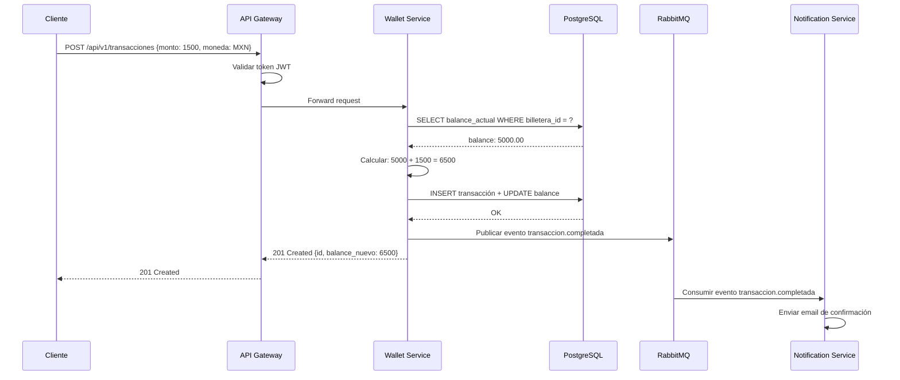

> **Objetivo**: Configurar un entorno de desarrollo profesional, entender el ciclo
> HTTP y establecer las bases para un proyecto de microservicios fintech.
>
> **Duración estimada**: 8–12 horas
>
> **Resultado**: Un entorno verificado y una comprensión sólida de HTTP/JSON
> aplicada al dominio de procesamiento de transacciones.

---

## Índice

- [0.1 El Curso y la Plataforma PrestaFlow](#01-el-curso-y-la-plataforma-prestaflow)
- [0.2 HTTP: El Ciclo Petición/Respuesta](#02-http-el-ciclo-peticiónrespuesta)
- [0.3 JSON como Contrato entre Microservicios](#03-json-como-contrato-entre-microservicios)
- [0.4 Entorno de Desarrollo](#04-entorno-de-desarrollo)
- [0.5 Git, TDD y el Flujo de Trabajo](#05-git-tdd-y-el-flujo-de-trabajo)
- [Ejercicios de la Parte 0](#ejercicios-de-la-parte-0)

---

## 0.1 El Curso y la Plataforma PrestaFlow

### Bienvenido

Este curso te llevará desde cero hasta la construcción de un ecosistema completo
de microservicios fintech. No es un tutorial superficial: cada línea de código
tiene un comentario explicando el *por qué*, cada concepto se valida con tests,
y cada servicio se despliega con Docker y Kubernetes.

**PrestaFlow** es una plataforma de pagos y préstamos. El dominio incluye:

- Tarjetas de crédito y cuentas de usuarios
- Procesamiento de transacciones (depósitos, retiros, transferencias)
- Aprobación de préstamos con reglas de negocio
- Notificaciones asíncronas entre servicios

### Arquitectura Final del Curso

```mermaid
graph TD
    APi["API Gateway\nNginx"] --> WS["wallet-service\nPHP 8.3 / Symfony 7"]
    WS --> LS["loan-service\nPHP 8.3"]
    WS --> PG1[("PostgreSQL\nwallet_db")]
    LS --> PG2[("PostgreSQL\nloan_db")]
    WS --- RMQ["RabbitMQ Event Bus\ntransactions · loans · notifications"]
    RMQ --- LS
    WS --- DD["Datadog APM\nTraces · Metrics · Logs"]
    style WS fill:#dbeafe,stroke:#1a56db,stroke-width:2px
    style APi fill:#f0fdf4,stroke:#16a34a,stroke-width:2px
    style LS fill:#fef3c7,stroke:#d97706,stroke-width:2px
    style RMQ fill:#fce7f3,stroke:#db2777,stroke-width:2px
    style DD fill:#ede9fe,stroke:#7c3aed,stroke-width:2px
```mermaid
sequenceDiagram
    participant C as Cliente (curl)
    participant DNS as DNS
    participant TLS as TCP/TLS
    participant S as Servidor (PHP)

    C->>DNS: 1. Resuelve "api.prestaflow"
    DNS-->>C: 2. Retorna IP
    C->>TLS: 3. Handshake TCP + TLS
    TLS-->>C: Conexión segura
    C->>S: 4. POST /api/v1/transacciones
    Note over S: Router → Controller → Domain → DB
    S-->>C: 5. HTTP 201 Created
```

> **En las Partes 2 y 3**, veremos cómo Symfony maneja internamente los pasos
> 4–6 de este diagrama. Por ahora, lo importante es entender la *contract*:
> qué envías (request) y qué recibes (response).

---

## 0.3 JSON como Contrato entre Microservicios

### ¿Por qué JSON?

En arquitectura de microservicios, cada servicio es un mundo independiente.
Lo que los conecta son **contratos**: acuerdos sobre el formato de los datos
que intercambian. JSON es el formato estándar porque:

1. **Legible**: Humanos y máquinas lo entienden
2. **Universal**: PHP, Python, Go, Node.js — todos lo soportan
3. **Flexible**: Soporta objetos anidados, arrays, tipos mixtos
4. **Compacto**: Menos bytes que XML para la misma información

### Regla de Oro en Fintech: Los Montos Son Strings

NUNCA envíes montos monetarios como floats en JSON:

```json
{
  "monto": "1500.00",
  "moneda": "MXN"
}
```

**¿Por qué?** Porque los floats tienen precisión limitada:

```php
<?php
// ❌ MAL: Floats pierden precisión
var_dump(0.1 + 0.2);        // float(0.3) ← parece bien, pero...
var_dump(0.1 + 0.2 === 0.3); // bool(false) ← ¡NO ES IGUAL!
var_dump(0.1 + 0.2);        // float(0.30000000000000004) ← aquí está el problema

// ✅ BIEN: Strings + conversión explícita a integer (centavos)
$montoCentavos = (int) (1500.00 * 100); // 150000 centavos
// El dominio trabaja en centavos internamente, pero muestra en decimales
```

### Contrato JSON: Transacción de Depósito

Este es el contrato que nuestros servicios usarán para registrar depósitos.
Lo estudiaremos en detalle cuando construyamos el wallet-service en la Parte 1.

**Request (lo que envía el cliente):**

```json
{
  "monto": "1500.00",
  "moneda": "MXN",
  "tipo": "deposito",
  "billetera_id": "wallet_x1y2z3",
  "idempotency_key": "dep_unique_abc123",
  "metadata": {
    "origen": "transferencia_bancaria",
    "referencia": "REF-2026-001"
  }
}
```

**Response exitosa (201 Created):**

```json
{
  "id": "txn_a1b2c3d4e5",
  "estado": "completada",
  "monto": "1500.00",
  "moneda": "MXN",
  "tipo": "deposito",
  "billetera_id": "wallet_x1y2z3",
  "balance_anterior": "5000.00",
  "balance_nuevo": "6500.00",
  "creado_en": "2026-09-10T15:30:00Z",
  "procesado_en": "2026-09-10T15:30:01Z"
}
```

**Response de error (422 Unprocessable Entity):**

```json
{
  "error": {
    "codigo": "FONDOS_INSUFICIENTES",
    "mensaje": "Saldo insuficiente para completar la transacción",
    "detalle": {
      "monto_solicitado": "5000.00",
      "saldo_disponible": "3200.00",
      "déficit": "1800.00"
    }
  }
}
```

### Idempotencia: Protección contra Duplicados

En sistemas distribuidos, una petición puede llegar al servidor **más de una
vez** (timeout de red, reintento automático, etc.). Sin idempotencia, un
cliente que reintenta un depósito de $1500 podría generar **dos** depósitos.

La solución es el **idempotency_key**: un identificador único que el cliente
genera y envía con cada petición. El servidor verifica:

```
Cliente                           Servidor
  │                                  │
  │ POST /deposito                   │
  │ idempotency_key: "abc-123"       │
  │ monto: 1500                      │
  │─────────────────────────────────▶│
  │                                  │ ¿Ya procesé "abc-123"?
  │                                  │   NO → Procesar, guardar resultado
  │ 201 Created                      │   SÍ  → Retornar resultado guardado
  │◀─────────────────────────────────│
  │                                  │
  │ POST /deposito  (reintento)      │
  │ idempotency_key: "abc-123"       │
  │ monto: 1500                      │
  │─────────────────────────────────▶│
  │                                  │ ¿Ya procesé "abc-123"?
  │ 201 Created                      │   SÍ → Retornar mismo resultado
  │◀─────────────────────────────────│     (sin procesar de nuevo)
```

> **Implementaremos idempotencia** en la Parte 3 cuando configuremos
> RabbitMQ con symfony/messenger y procesamiento exactly-once.

---

## 0.4 Entorno de Desarrollo

### Paso 1: Verificar PHP 8.3+

```bash
# Verificar versión de PHP instalada
php --version
```

**Salida esperada:**

```
PHP 8.3.12 (cli) (built: Sep  5 2026 14:21:03) (NTS)
Copyright (c) The PHP Group
Zend Engine v4.3.12, Copyright (c) Zend Technologies
    with Zend OPcache v8.3.12, Copyright (c), by Zend Technologies
    with Xdebug v3.3.2, Copyright (c) 2002-2024, by Derick Rethans
```

> **Si no tienes PHP 8.3+**, instálalo:
>
> - **macOS**: `brew install php@8.3`
> - **Ubuntu/Debian**: `sudo apt install php8.3 php8.3-cli php8.3-mbstring php8.3-xml php8.3-curl php8.3-zip`
> - **Windows**: Descarga desde https://windows.php.net/download/ o usa WSL2 + Ubuntu

### Paso 2: Verificar Composer

```bash
# Verificar Composer (gestor de dependencias PHP)
composer --version
```

**Salida esperada:**

```
Composer version 2.7.8 2024-06-11 17:19:33
```

```bash
# Si no tienes Composer, instálalo con el instalador oficial
curl -sS https://getcomposer.org/installer | php
# Mover el phar al PATH global
sudo mv composer.phar /usr/local/bin/composer
```

### Paso 3: Symfony CLI

```bash
# Verificar Symfony CLI
symfony version
```

**Salida esperada:**

```
Symfony CLI 7.2.3 (v7.2.3)
```

```bash
# Instalar Symfony CLI
# macOS/Linux:
curl -sS https://get.symfony.com/cli/installer | bash
# Agregar al PATH (añadir a ~/.bashrc o ~/.zshrc)
export PATH="$HOME/.symfony5/bin:$PATH"
```

### Paso 4: Crear el Directorio del Curso

```bash
# Crear directorio raíz del curso
mkdir -p ~/fsc-php-curso
cd ~/fsc-php-curso

# Inicializar git
git init
git branch -M main

# Crear estructura del monorepo
mkdir -p parte0/ejercicios
mkdir -p parte0/scripts
mkdir -p parte1/ejercicios
mkdir -p parte1/soluciones
mkdir -p docs/images

# Primer commit: esqueleto del monorepo
touch .editorconfig
echo "# FSC-PHP: Microservicios Fintech" > README.md
git add .
git commit -m "chore: inicializar monorepo del curso"
```

**Salida esperada:**

```
[main (root-commit) a1b2c3d] chore: inicializar monorepo del curso
 4 files changed, 1 insertion(+)
 create mode 100644 .editorconfig
 create mode 100644 README.md
```

### Paso 5: Docker (para la Lección 0.2)

```bash
# Verificar Docker
docker --version
docker compose version
```

**Salida esperada:**

```
Docker version 27.1.1, build 100c701
Docker Compose version v2.29.1
```

### Paso 6: Ejecutar el Verificador de Entorno

El curso incluye un script que verifica todo automáticamente:

```bash
# Desde la raíz del monorepo
bash parte0/scripts/doctor.sh
```

**Salida esperada:**

```
╔══════════════════════════════════════════════════════╗
║   FSC-PHP — Verificador de Entorno de Desarrollo    ║
╚══════════════════════════════════════════════════════╝

  ✓ PHP: 8.3.12 (cumple requisito ≥8.3)
  ✓ Composer: 2.7.8 (cumple requisito ≥2.7)
  ✓ Symfony CLI: 7.2.3
  ✓ Git: 2.43.0 (user: Juan Laguna <juan@ejemplo.com>)
  ✓ Docker: 27.1.1 (daemon corriendo)
  ✓ Docker Compose: 2.29.1

═══════════════════════════════════════════════════════
  Resumen: 5 verificados | 1 advertencias | 0 fallidos
═══════════════════════════════════════════════════════
  Veredicto: READY — Tu entorno está listo para el curso.

--- Salida JSON ---
{
  "php": { "installed": true, "version": "8.3.12", "meets_requirement": true },
  "composer": { "installed": true, "version": "2.7.8", "meets_requirement": true },
  "symfony_cli": { "installed": true, "version": "7.2.3" },
  "git": { "installed": true, "version": "2.43.0", "configured": true },
  "docker": { "installed": true, "version": "27.1.1", "running": true },
  "docker_compose": { "installed": true, "version": "2.29.1" },
  "verdict": "READY"
}
```

### Checkpoint 0.4 ✓

Tu entorno debe mostrar `verdict: "READY"` en el script doctor.sh.
Si tienes errores, revisa las secciones de instalación de cada herramienta.

---

## 0.5 Git, TDD y el Flujo de Trabajo del Curso

### Git: El Historial Cuenta una Historia

En este curso, los commits de Git no son un formalismo. Son una **documentación
viva** de cómo evoluciona el código. Usaremos [Conventional Commits](https://www.conventionalcommits.org/):

```
tipo(alcance): descripción corta en imperativo

Tipos:
  feat     → Nueva funcionalidad (feature)
  fix      → Corrección de un bug
  test     → Agregar o modificar tests (sin cambiar comportamiento)
  refactor → Reestructurar código (sin cambiar comportamiento)
  chore    → Tareas de mantenimiento (deps, config, CI)
  docs     → Documentación
  style    → Formato (no afecta lógica)
  ci       → Integración continua
```

**Ejemplo de historial del curso:**

```
a1b2c3d  chore: inicializar monorepo del curso
d4e5f6a  feat(parte1): crear SaludController con GET /salud
g7h8i9j  test(parte1): agregar test funcional de SaludController
k0l1m2n  feat(parte1): implementar objeto de valor Dinero
o3p4q5r  test(parte1): agregar tests unitarios de Dinero con DataProviders
s6t7u8v  feat(parte1): implementar aggregate Billetera
w9x0y1z  test(parte1): agregar test de arquitectura DominioPuro
a2b3c4d  chore(parte1): configurar PHPStan nivel 6 + CS-Fixer
```

### TDD: Red → Green → Refactor

TDD (Test-Driven Development) es el ciclo de:

```
    ┌───────────┐
    │   RED     │  ← Escribes un TEST que FALLA
    │ (fallo)   │     (porque la funcionalidad no existe aún)
    └─────┬─────┘
          │
          ▼
    ┌───────────┐
    │  GREEN    │  ← Escribes MÍNIMO código para que pase
    │ (éxito)   │     (no más, no menos — solo lo necesario)
    └─────┬─────┘
          │
          ▼
    ┌───────────┐
    │ REFACTOR  │  ← Limpias el código sin cambiar comportamiento
    │ (limpieza)│     (el test sigue pasando)
    └─────┬─────┘
          │
          ▼
      Siguiente
      funcionalidad
```

### Ejemplo: Primer Test con PHPUnit

Veamos el ciclo TDD completo con un ejemplo simple. Crearemos una función
que valida si un monto es positivo:

```php
<?php
// tests/Unit/MontoTest.php

declare(strict_types=1);

// Importamos la clase TestCase de PHPUnit
// Esta clase provee los métodos de aserción (assert*)
use PHPUnit\Framework\TestCase;

// PHPUnit 11 usa atributos PHP 8 en lugar de anotaciones docblock.
// #[Test] marca un método como test ejecutable.
// #[CoversClass] indica qué clase está siendo testeada (para cobertura).
// PHPUnit no ejecuta métodos sin #[Test].
final class MontoTest extends TestCase
{
    // #[Test] → PHPUnit ejecutará este método como un caso de prueba
    #[Test]
    // #[DataProvider('montonPositivo')] → Vincula un DataProvider que
    // provee múltiples conjuntos de datos para el mismo test.
    // El método 'montonPositivo' retorna un array de arrays.
    #[DataProvider('montonPositivo')]
    // El método recibe un string (el monto) y un entero (centavos esperados).
    // Si el monto no es un número válido, PHPUnit lanzará error antes del assert.
    public function test_monto_valido_se_convierte_a_centavos(string $monto, int $centavosEsperados): void
    {
        // Llamamos a la función que vamos a construir (TDD: primero el test)
        // Convierte un monto string a centavos integer
        $resultado = montoACentavos($monto);

        // assertEquals compara el resultado esperado con el obtenido.
        // Si no son iguales, PHPUnit muestra ambos valores y falla el test.
        $this->assertSame($centavosEsperados, $resultado);
    }

    // DataProvider: retorna un array de arrays.
    // Cada sub-array = [monto_input, centavos_esperados]
    // PHPUnit ejecuta el test UNA VEZ por cada sub-array.
    // Esto reemplaza los test methods duplicados: test_monto_100, test_monto_50, etc.
    public static function montonPositivo(): array
    {
        return [
            // [input_monto, centavos_esperados]
            // Un dólar = 100 centavos
            ['1.00', 100],
            // Quinientos pesos = 50000 centavos
            ['500.00', 50000],
            // Un centavo (caso borde mínimo)
            ['0.01', 1],
            // Monto sin decimales
            ['10', 1000],
        ];
    }

    // Test que verifica el comportamiento ante montos inválidos.
    // PHPUnit provee la aserciónexpectException() que VALIDA que se lance
    // una excepción específica. Si NO se lanza, el test FALLA.
    #[Test]
    public function test_monto_negativo_lanza_excepcion(): void
    {
        // Indicamos que esperamos esta excepción específica
        // Si la función NO lanza la excepción → test FALLA
        // Si lanza OTRA excepción → test FALLA
        // Si lanza esta excepción → test PASA
        $this->expectException(\InvalidArgumentException::class);

        montoACentavos('-50.00');
    }
}
```

**Salida al ejecutar (con el código implementado):**

```bash
$ ./vendor/bin/phpunit tests/Unit/MontoTest.php
```

```
PHPUnit 11.3.0 by Sebastian Bergmann and contributors.

...                                                                 3 / 3 (100%)

Time: 00:00.012, Memory: 6.14 MB

OK (3 tests, 4 assertions)
```

### Ejemplo: Código Implementado (después de TDD)

```php
<?php
// src/Domain/Monto.php

declare(strict_types=1);

/**
 * Convierte un monto en formato decimal (string) a centavos (integer).
 *
 * ¿Por qué centavos? Porque los floats son imprecisos en PHP:
 *   0.1 + 0.2 = 0.30000000000000004 (¡no es 0.3!)
 *
 * Trabajar en centavos (enteros) garantiza precisión exacta.
 * Este patrón es estándar en toda la industria fintech.
 *
 * @param string $monto Monto en formato decimal, ej: "1500.00"
 *
 * @return int Monto en centavos, ej: 150000
 *
 * @throws \InvalidArgumentException Si el monto no es un número válido o es negativo
 */
function montoACentavos(string $monto): int
{
    // Verificar que el monto tenga un formato decimal válido.
    // filter_var con FILTER_VALIDATE_FLOAT valida que sea un número flotante.
    // Si no lo es, retorna false (que no es int, por eso !== false).
    $valor = filter_var($monto, FILTER_VALIDATE_FLOAT);

    // Validación defensiva: si filter_var retorna false, el input es inválido.
    // Lanazmos la excepción con un mensaje descriptivo para debugging.
    if ($valor === false) {
        throw new \InvalidArgumentException(
            "Monto inválido: '{$monto}'. Se esperaba un número decimal."
        );
    }

    // Validar que el monto no sea negativo.
    // En finanzas, montos negativos tienen un significado diferente (cargo vs abono).
    // Esta función solo acepta montos positivos para depósitos.
    if ($valor < 0) {
        throw new \InvalidArgumentException(
            "El monto no puede ser negativo: '{$monto}'"
        );
    }

    // Multiplicar por 100 para convertir decimales a centavos.
    // round() evita errores de punto flotante: 1.005 * 100 = 100.4999... → 100
    // PHP_INT_MAX = 9223372036854775807, así que enteros hasta ~92 billones de centavos
    return (int) round($valor * 100);
}
```

**Salida al ejecutar:**

```bash
$ php -r "
require 'src/Domain/Monto.php';
echo montoACentavos('1500.00') . PHP_EOL;  // 150000
echo montoACentavos('0.01') . PHP_EOL;     // 1
echo montoACentavos('99.99') . PHP_EOL;    // 9999
"
```

```
150000
1
9999
```

### Checkpoint 0.5 ✓

Antes de avanzar a la Parte 1, deberías tener:

```
~/fsc-php-curso/
├── .editorconfig
├── README.md
└── parte0/
    ├── README.md    ← Este archivo
    ├── ejercicios/
    │   ├── 0.1-http-requests.md
    │   ├── 0.2-sequence-diagram.md
    │   ├── 0.3-json-contract.md
    │   ├── 0.4-entorno-verificado.md
    │   └── 0.5-git-workflow.md
    └── scripts/
        └── doctor.sh
```

---

## Ejercicios de la Parte 0

Los ejercicios consolidan lo aprendido. Cada uno tiene un entregable concreto.

---

### Ejercicio 0.1: Practicar Peticiones HTTP

**Objetivo**: Familiarizarte con curl y los métodos HTTP.

**Instrucciones**:

1. Realiza un GET a `https://jsonplaceholder.typicode.com/posts` y guarda la
   respuesta en un archivo `respuesta-get.json`.

2. Realiza un POST al mismo endpoint con estos datos:

```json
{
  "title": "Depósito inicial",
  "body": "Primera transacción de mi billetera",
  "userId": 42
}
```

3. Guarda la respuesta en `respuesta-post.json`.

4. Realiza un GET a `https://jsonplaceholder.typicode.com/users/1` y extrae
   solo el campo `email` usando `jq` (instalar con `apt install jq` o
   `brew install jq`).

**Entregable**: Archivos `respuesta-get.json` y `respuesta-post.json` +
comando con `jq` que extrae el email.

**Verificación**:

```bash
# El GET debe retornar 100 posts
cat respuesta-get.json | python3 -c "import json,sys; print(len(json.load(sys.stdin)))"
# Salida: 100

# El POST debe retornar id=101
cat respuesta-post.json | python3 -c "import json,sys; print(json.load(sys.stdin)['id'])"
# Salida: 101

# El jq debe extraer el email
cat users.json | jq '.email'
# Salida: "Sincere@april.biz"
```

---

### Ejercicio 0.2: Diagrama de Secuencia de un Depósito

**Objetivo**: Visualizar el flujo de una transacción entre microservicios.

**Instrucciones**:

Usando [Mermaid](https://mermaid.live) o papel, crea un diagrama de secuencia
que muestre el flujo de un depósito de $1500 MXN:

**Actores**: Cliente → API Gateway → Wallet Service → PostgreSQL → RabbitMQ → Notification Service

**Pasos del flujo**:

1. Cliente envía POST /api/v1/transacciones con monto 1500 MXN
2. API Gateway valida el token JWT
3. Wallet Service verifica saldo actual
4. Wallet Service calcula nuevo balance
5. Wallet Service guarda la transacción en PostgreSQL
6. Wallet Service publica evento "transaccion.completada" en RabbitMQ
7. Notification Service consume el evento
8. Notification Service envía email de confirmación
9. API Gateway retorna 201 Created al cliente

**Entregable**: Archivo `docs/images/diagrama-deposito.mmd` con el Mermaid code.



**Verificación**: El diagrama debe ser válido en https://mermaid.live (sin errores de sintaxis).

---

### Ejercicio 0.3: Validar un Contrato JSON

**Objetivo**: Practicar la validación de contratos entre servicios.

**Instrucciones**:

1. Descarga e instala `jq` si no lo tienes:

```bash
# macOS
brew install jq

# Ubuntu/Debian
sudo apt install jq

# Windows (WSL2)
sudo apt install jq
```

2. Crea un archivo `transaccion-request.json` con este contenido:

```json
{
  "monto": "1500.00",
  "moneda": "MXN",
  "tipo": "deposito",
  "billetera_id": "wallet_x1y2z3",
  "idempotency_key": "dep_unique_abc123"
}
```

3. Escribe un script `validar-contrato.sh` que use `jq` para verificar:

   a. Que `monto` sea un string (no un número)
   b. Que `moneda` tenga exactamente 3 caracteres
   c. Que `tipo` sea uno de: `deposito`, `retiro`, `transferencia`
   d. Que `idempotency_key` no esté vacío

4. El script debe imprimir `CONTRATO VÁLIDO` o `CONTRATO INVÁLIDO: [razón]`.

**Entregable**: Archivo `validar-contrato.sh` ejecutable.

**Verificación**:

```bash
# Debe imprimir CONTRATO VÁLIDO
bash validar-contrato.sh transaccion-request.json

# Debe imprimir error por monto inválido
echo '{"monto": 1500, "moneda": "MXN", "tipo": "deposito", "billetera_id": "w1", "idempotency_key": "k1"}' | bash validar-contrato.sh /dev/stdin
# Salida: CONTRATO INVÁLIDO: monto debe ser string, no number
```

---

### Ejercicio 0.4: Verificar tu Entorno

**Objetivo**: Asegurar que tu entorno está correctamente configurado.

**Instrucciones**:

1. Ejecuta el verificador de entorno:

```bash
bash parte0/scripts/doctor.sh
```

2. Si el veredicto es `READY`, toma una captura de pantalla de la salida.

3. Si el veredicto es `NOT READY`, corrige los problemas e intenta de nuevo.

**Entregable**: Captura de pantalla o copia del JSON de salida con `verdict: "READY"`.

**Verificación**: El JSON debe tener `"verdict": "READY"`.

---

### Ejercicio 0.5: Flujo de Trabajo con Git

**Objetivo**: Practicar Conventional Commits y el flujo de trabajo del curso.

**Instrucciones**:

1. Crea un directorio llamado `mi-primer-repo` e inicialízalo con Git:

```bash
mkdir mi-primer-repo && cd mi-primer-repo
git init
git branch -M main
```

2. Crea un archivo `hola.txt` con el contenido "Hola PrestaFlow" y haz commit:

```bash
echo "Hola PrestaFlow" > hola.txt
git add hola.txt
git commit -m "docs: crear archivo de bienvenida"
```

3. Crea un archivo `suma.php` con una función que sume dos números:

```php
<?php
// suma.php
function sumar(int $a, int $b): int {
    return $a + $b;
}

echo sumar(2, 3) . PHP_EOL;
```

4. Haz commit con el tipo adecuado.

5. Crea un archivo `test-suma.php` que verifique que `sumar(2, 3) === 5`:

```php
<?php
// test-suma.php
require 'suma.php';

$resultado = sumar(2, 3);
$esperado = 5;

if ($resultado === $esperado) {
    echo "✓ Test pasó: sumar(2, 3) = {$resultado}" . PHP_EOL;
    exit(0);
} else {
    echo "✗ Test falló: esperaba {$esperado}, obtuve {$resultado}" . PHP_EOL;
    exit(1);
}
```

5. Ejecuta el test y haz commit con el tipo `test`.

6. Revisa el historial con `git log --oneline`.

**Entregable**: Historial de Git con al menos 3 commits con mensajes Convencionales.

**Verificación**:

```bash
# El test debe pasar
php test-suma.php
# Salida: ✓ Test pasó: sumar(2, 3) = 5

# El log debe mostrar commits convencionales
git log --oneline
# Salida ejemplo:
# b2c3d4e test: agregar test de la función sumar
# a1b2c3d feat: crear función sumar
# f0e1d2c docs: crear archivo de bienvenida
```

---

## Siguiente Paso

Una vez completados los ejercicios de la Parte 0, avanza a la **Parte 1: PHP 8.2+ Moderno, POO Avanzada y Fundamentos** donde construiremos el primer microservicio del ecosistema PrestaFlow.
