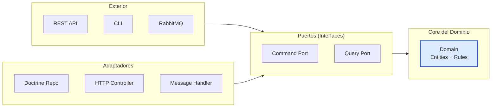

### Arquitectura de Capas



### REST API Design

| Método | Ruta | Descripción | Status Codes |
|---|---|---|---|
| `POST` | `/api/v1/billeteras` | Crear billetera | 201, 400, 409 |
| `GET` | `/api/v1/billeteras/{id}` | Consultar billetera | 200, 404 |
| `POST` | `/api/v1/billeteras/{id}/deposito` | Realizar depósito | 200, 400, 404, 422 |
| `GET` | `/api/v1/billeteras/{id}/movimientos` | Historial | 200, 404 |

### Respuestas JSON Estructuradas

**Éxito (201 Created):**

```json
{
  "id": "550e8400-e29b-41d4-a716-446655440000",
  "usuario_id": "user_001",
  "moneda": "MXN",
  "saldo": "0.00",
  "creado_en": "2026-09-10T15:30:00+00:00"
}
```

**Error (400 Bad Request):**

```json
{
  "error": {
    "codigo": "CAMPOS_REQUERIDOS",
    "mensaje": "Los campos \"usuario_id\" y \"moneda\" son obligatorios"
  }
}
```

**Error (422 Unprocessable Entity):**

```json
{
  "error": {
    "codigo": "FONDOS_INSUFICIENTES",
    "mensaje": "Saldo insuficiente para completar la transacción",
    "detalle": {
      "saldo_actual": "500.00",
      "monto_solicitado": "1500.00",
      "déficit": "1000.00"
    }
  }
}
```

### Checkpoint 2.4 ✓

```bash
# Crear una billetera
curl -s -X POST http://localhost:8080/api/v1/billeteras \
  -H "Content-Type: application/json" \
  -d '{"usuario_id":"user_001","moneda":"MXN"}' | python3 -m json.tool
```

**Salida esperada:**

```json
{
    "id": "550e8400-e29b-41d4-a716-446655440000",
    "usuario_id": "user_001",
    "moneda": "MXN",
    "saldo": "0.00",
    "creado_en": "2026-09-10T15:30:00+00:00"
}
```

---
