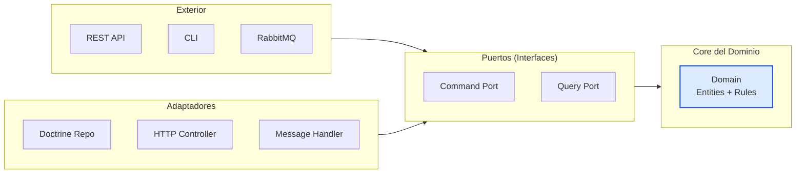

> **Objetivo**: Dockerizar el wallet-service, conectarlo a PostgreSQL, y demostrar
> la separación entre Dominio, Aplicación e Infraestructura.
>
> **Duración estimada**: 18–24 horas
>
> **Resultado**: wallet-service dockerizado con API REST funcional, persistencia en PostgreSQL,
> tests de integración y funcionales pasando.
>
> **Prerrequisito**: Parte 1 completada (wallet-service con make ci pasando)

---

## Índice

- [2.1 Dockerización Profesional](#21-dockerización-profesional)
- [2.2 Configuración de Symfony y Dependency Injection](#22-configuración-de-symfony-y-dependency-injection)
- [2.3 Doctrine ORM y Persistencia](#23-doctrine-orm-y-persistencia)
- [2.4 API REST: Controllers con Lógica Real](#24-api-rest-controllers-con-lógica-real)
- [2.5 Arquitectura Hexagonal en la Práctica](#25-arquitectura-hexagonal-en-la-práctica)
- [2.6 Tests de Integración y Funcionales](#26-tests-de-integración-y-funcionales)
- [Ejercicios de la Parte 2](#ejercicios-de-la-parte-2)

---

## 2.1 Dockerización Profesional

### ¿Por qué Docker?

Docker resuelve el problema de "funciona en mi máquina":



### Dependency Injection en Práctica

```php
<?php
// Ejemplo de inyección automática (autowire).

// Symfony lee el constructor y crea automáticamente las dependencias:
class BilleteraController extends AbstractController
{
    // Symfony ve: "necesito CrearBilleteraService"
    // Symfony ve: "CrearBilleteraService necesita BilleteraRepository"
    // Symfony crea ambos y los inyecta.
    public function __construct(
        private readonly CrearBilleteraService $crearService,
    ) {}
}

// ¿Qué hace Symfony internamente?
// 1. Lee el container: $container->get('App\Application\Service\CrearBilleteraService')
// 2. Lee el constructor de CrearBilleteraService: __construct(BilleteraRepository $repo)
// 3. Busca BilleteraRepository en el container: $container->get('App\Infrastructure\Repository\BilleteraRepository')
// 4. Crea CrearBilleteraService con el repository inyectado
// 5. Retorna la instancia lista para usar


### REST API Design

| Método | Ruta | Descripción | Status Codes |
|---|---|---|---|
| `POST` | `/api/v1/billeteras` | Crear billetera | 201, 400, 409 |
| `GET` | `/api/v1/billeteras/{id}` | Consultar billetera | 200, 404 |
| `POST` | `/api/v1/billeteras/{id}/deposito` | Realizar depósito | 200, 400, 404, 422 |
| `GET` | `/api/v1/billeteras/{id}/movimientos` | Historial | 200, 404 |

### Respuestas JSON Estructuradas

**Éxito (201 Created):**

```json
{
  "id": "550e8400-e29b-41d4-a716-446655440000",
  "usuario_id": "user_001",
  "moneda": "MXN",
  "saldo": "0.00",
  "creado_en": "2026-09-10T15:30:00+00:00"
}
```mermaid
graph LR
    subgraph Exterior["Exterior"]
        API["REST API"]
        CLI["CLI"]
        MQ["RabbitMQ"]
    end
    subgraph Puertos["Puertos (Interfaces)"]
        CP["Command Port"]
        QP["Query Port"]
    end
    subgraph Core["Core del Dominio"]
        DOM["Domain\nEntities + Rules"]
    end
    subgraph Adaptadores["Adaptadores"]
        AD1["Doctrine Repo"]
        AD2["HTTP Controller"]
        AD3["Message Handler"]
    end
    Exterior --> Puertos
    Puertos --> Core
    Adaptadores --> Puertos
    style DOM fill:#dbeafe,stroke:#1a56db,stroke-width:2px
```bash
./vendor/bin/phpunit tests/Unit/Application/ --testdox
```

**Puntos**: 6

---

### Ejercicio 2.4: API REST de Billeteras

**Objetivo**: Exponer la API de billeteras a través de HTTP.

**Instrucciones**:

1. Crear `BilleteraController` con endpoints: crear, obtener, depositar
2. Configurar rutas en `config/routes.yaml`
3. Implementar respuestas JSON consistentes
4. Probar con curl

**Verificación**:

```bash
# Crear billetera
curl -s -X POST http://localhost:8080/api/v1/billeteras \
  -H "Content-Type: application/json" \
  -d '{"usuario_id":"test","moneda":"MXN"}' | jq '.id'
# Debe retornar un UUID

# Depositar
curl -s -X POST http://localhost:8080/api/v1/billeteras/{id}/deposito \
  -H "Content-Type: application/json" \
  -d '{"monto":"1500.00","descripcion":"Test"}' | jq '.balance_nuevo'
# Debe retornar "1500.00"
```

**Puntos**: 8

---

### Ejercicio 2.5: Tests de Integración

**Objetivo**: Verificar que el Repository funcione con la BD real.

**Instrucciones**:

1. Crear tests de integración para BilleteraRepository
2. Test: guardar y recuperar billetera
3. Test: guardar con depósito y verificar saldo
4. Test: contar y buscar por usuario

**Verificación**:

```bash
./vendor/bin/phpunit tests/Integration/ --testdox
```

**Puntos**: 6

---

### Ejercicio 2.6: Tests Funcionales

**Objetivo**: Verificar la API completa vía HTTP simulado.

**Instrucciones**:

1. Crear tests funcionales con WebTestCase
2. Test: GET /salud retorna 200
3. Test: POST /api/v1/billeteras crea billetera
4. Test: POST sin campos retorna 400
5. Test: GET billetera inexistente retorna 404

**Verificación**:

```bash
./vendor/bin/phpunit tests/Functional/ --testdox
```

**Puntos**: 8

---

### Ejercicio 2.7: Arquitectura Hexagonal

**Objetivo**: Verificar que el dominio se mantiene puro.

**Instrucciones**:

1. Ejecutar el test de arquitectura de la Parte 1
2. Verificar que src/Domain/ no importa Symfony ni Doctrine
3. Verificar que los Value Objects son readonly

**Verificación**:

```bash
./vendor/bin/phpunit tests/Architecture/ --testdox
```

**Puntos**: 4

---

### Ejercicio 2.8: Pipeline CI con Docker

**Objetivo**: Ejecutar la pipeline completa dentro de Docker.

**Instrucciones**:

1. Ejecutar tests unitarios, integración, y funcionales dentro del contenedor
2. Ejecutar PHPStan nivel 6
3. Ejecutar CS-Fixer dry-run
4. Verificar que todo pasa

**Verificación**:

```bash
docker compose exec php-fpm make ci
# Debe mostrar: ✅ CI PASSED
```

**Puntos**: 5

---

## Siguiente Paso

Una vez completados los ejercicios de la Parte 2, avanza a la **Parte 3: CQRS y Event-Driven Architecture con RabbitMQ** donde:
- Separaremos Commands y Queries (CQRS)
- Configuraremos Symfony Messenger con RabbitMQ
- Crearemos el primer microservicio asíncrono (loan-service)
- Implementaremos eventos de dominio entre servicios
