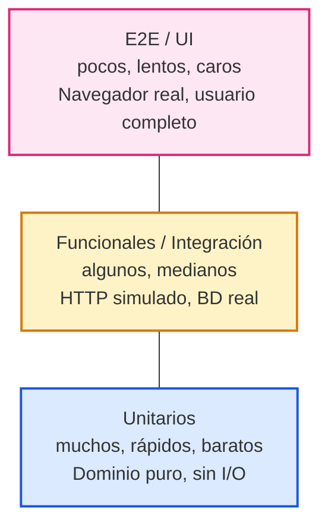

### Filosofía de la pirámide



| Capa | Velocidad por test | Ejecuta en CI | ¿Qué derriba? |
|---|---|---|---|
| Unit | ~5 ms | cientos en <1s | una regla de negocio |
| Integration | ~50 ms | decenas en <2s | una query o mapper |
| Functional | ~200 ms | decenas en <5s | un flujo HTTP completo |
| E2E / Behat | ~1 s | pocos en <30s | una historia de usuario |

### La regla de oro: el 80% de tus tests deben ser unitarios

¿Por qué tanta insistencia en los unit?

```
Costo de mantenimiento por test (relativo):

  Unit        █                   ← barato, se escribe en minutos
  Integration ████                ← necesita BD real, fixtures
  Functional  ████████            ← necesita HTTP, servicio completo
  E2E         ██████████████      ← frágil, lento, caro

Beneficio de cada unit test: te dice EXACTAMENTE qué se rompió
en 5 milisegundos y sin levantar infraestructura.
```

### Nuestra capa de dominio es un regalo para la pirámide

El dominio de PrestaFlow (`Dinero`, `Billetera`, `Moneda`) es **puro PHP**:
no depende de Symfony, Doctrine ni HTTP. Esto significa que puedes
testearlo con corredores en memoria, sin levantarse Docker.

```
┌──────────────────────────────────────────────────┐
│  test unit de Dinero:                             │
│  $dineros → Dinero::crear(...) → probar resultados │
│  ✅ 0 ms, sin BD, sin framework                    │
└──────────────────────────────────────────────────┘
```

---
