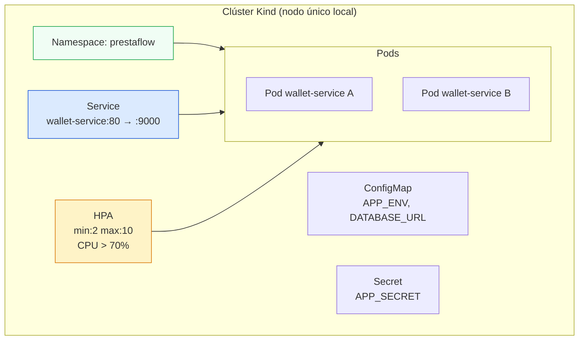

### Conceptos mínimos

| Recurso | Qué declara | Ejemplo |
|---|---|---|
| `Namespace` | Divide el clúster en ambientes | `prestaflow` |
| `Deployment` | Estado deseado (imagen, réplicas, recursos) | 2 réplicas de `ghcr.io/…/wallet-service:5.0.0` |
| `Service` | IP/DNS estable hacia los pods | `wallet-service` en puerto 80 |
| `ConfigMap` | Config no sensible | `DATABASE_URL` (dnsname) |
| `Secret` | Config sensible (base64, mejor con SOPS/vault) | `APP_SECRET`, password de postgres |
| `HorizontalPodAutoscaler` | Escala las réplicas según métricas | CPU > 70% → escala a 10 |

### Reglas de oro de manifiestos

1. **Declara el estado deseado**, no pasos. K8s converge.
2. **`readinessProbe`** para no mandar tráfico a pods que no responden.
3. **`resources.requests/limits`** SIEMPRE: sin ellos el HPA no funciona
   y un pod puede comerse el nodo.
4. **`imagePullPolicy: IfNotPresent`** en dev, `Always` en CI/CD real.
5. Los Secrets NO se versionan en claro (aquí usamos `kubectl create`
   para el curso — en producción: SOPS, Vault o External Secrets).

> El curso usa Kind (clúster en Docker) para que puedas probar todo
> localmente: `kind create cluster` y a desplegar.

---
