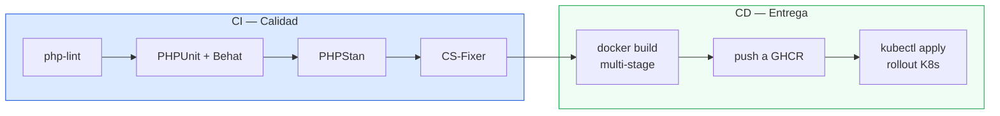

### La pipeline de dos etapas



### `ci.yml` (9 líneas de esencia)

```yaml
name: CI
on: [push, pull_request]
jobs:
  test:
    runs-on: ubuntu-latest
    services:
      postgres: { image: postgres:16, env: { POSTGRES_PASSWORD: test } }
    steps:
      - uses: actions/checkout@v4
      - uses: shivammathur/setup-php@v2
        with: { php-version: '8.3', tools: composer }
      - run: composer install --no-interaction
      - run: make test
```

### `cd.yml` (el deploy)

```yaml
on:
  push:
    branches: [ main ]
jobs:
  deploy:
    runs-on: ubuntu-latest
    steps:
      - uses: actions/checkout@v4
      - run: docker build -t ghcr.io/${{ github.repository }}/wallet-service .
      - run: docker push ghcr.io/${{ github.repository }}/wallet-service
      - uses: azure/setup-kubectl@v4
      - run: kubectl set image deployment/wallet-service ...
```

> El deploy a Kind local desde Actions es posible con `kind` +
> `kubectl` remoto. En una empresa real el CD apunta a AWS/GCP/Azure;
> para el curso, GitHub Actions dispara la actualización del clúster
> Kind que ya corre en tu máquina (patrón "GitOps-lite").

---
