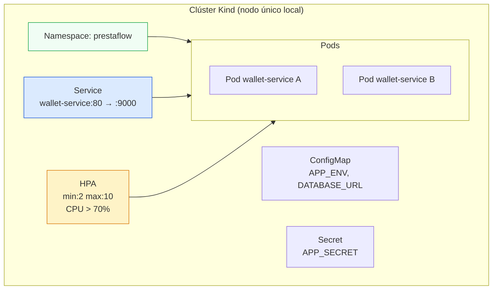
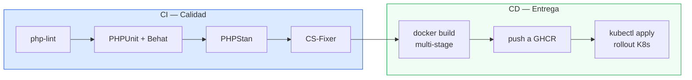

> **En esta parte lleva PrestaFlow a producción.**
> Aprendes la trifecta de la observabilidad (logs, métricas y trazas) con
> Datadog APM, creas spans personalizados en tus manejadores CQRS, empaquetas
> el servicio en una imagen de producción multi-stage, lo despliegas en
> Kubernetes (Deployment, Service, ConfigMap, Secret, HPA) y automatizas
> TODO con GitHub Actions: desde el push hasta el deploy en el clúster.

---

## Contenido

| Lección | Tema | Herramienta |
|---|---|---|
| 5.1 | Trifecta de la observabilidad | Logs, métricas, trazas |
| 5.2 | Datadog APM y spans personalizados | ddtrace, DDTrace\Span |
| 5.3 | Imagen de producción multi-stage | Docker |
| 5.4 | Kubernetes: Despliegue en clúster | Kind, kubectl |
| 5.5 | CI/CD automático | GitHub Actions |

**Ejercicios 5.1 – 5.8 · Puntos: 52 · Total acumulado: 292**

---

## 5.1 La trifecta de la observabilidad

### ¿Por qué observabilidad?

Tu código funciona en tu máquina… y en producción es OTRA cosa.
Cuando un depósito falla a las 3am con RabbitMQ caído, necesitas
responder **tres preguntas**:

```
1. ¿QUÉ pasó?        → LOGS      (eventos con contexto)
2. ¿CUÁNTO afecta?   → MÉTRICAS  (contadores, latencias, saturación)
3. ¿DÓNDE pasó?      → TRAZAS    (el viaje completo de una operación)
```

Un sistema es **observable** si puedes responder esas tres preguntas
sin desplegar código nuevo.

### Los tres pilares (y por qué necesitas los tres)

| Pilar | Ejemplo en PrestaFlow | Si solo tuvieras esto… |
|---|---|---|
| Logs | `Depósito 500.00 MXN OK en wallet-abc (idempotencia: hit)` | Sabes qué pasó, pero no el impacto agregado |
| Métricas | `reparticion.depositos{resultado="exito"} = 1` | El dashboard parpadea rojo, pero ¿qué operación exacta falló? |
| Trazas | Span `RealizarDepositoCommandHandler` 42ms → SQL 12ms → RabbitMQ 3ms | Correlacionas TODO de una sola operación |

### Logs estructurados (no texto plano)

Un log **de texto libre** es una foto borrosa. Uno **estructurado** es
una base de datos accesible:

```php
// ❌ Log de texto libre (inutilizable con grep en volumen)
$logger->warning('Deposito fallo para la billetera ' . $id . ' monto ' . $monto);

// ✅ Log estructurado (indexable, filtrable, correlacionable)
$logger->warning('Deposito rechazado', [
    'billetera' => $id,
    'monto'     => $monto,
    'moneda'    => 'MXN',
    'razon'     => $e->getMessage(),
    'trace_id'  => \DDTrace\logs\get_request_id(), // correlación con APM
]);
```

Symfony trae `monolog` de serie: escribe JSON, agrega contexto, rota
archivos. Lo importante es el **formato de clave-valor**.

> Regla de oro: cada log DEBE poder responderse: ¿qué operación,
> para qué entidad, con qué payload, y en qué trace?

---

## 5.2 Datadog APM y spans personalizados

### Cómo funciona ddtrace

Datadog APM instrumenta tu app automáticamente gracias a la extensión
`ddtrace`:

```
  Solicitud HTTP ─→ Middleware traza (span: "symfony.controller")
                       │
                       ├─→ QueryBus.handle (span automático?)
                       │      └─→ RealizarDepositoCommandHandler
                       │             ├─→ SQL (span: "postgres.query")
                       │             └─→ RabbitMQ publish (span)
                       └─→ Respuesta con trace_id en headers
```

La instrumentación automática ya te da un trace completo. Pero los
**spans personalizados** te dan el **porqué**:

### Creando un span en tu CommandHandler

```php
use DDTrace\SpanData;

final class RealizarDepositoCommandHandler
{
    // ...
    public function __invoke(RealizarDepositoCommand $comando): array
    {
        $span = DD\trace_start_span();
        $span->name = 'deposito.procesar';
        $span->resource = $comando->billeteraId;
        $span->meta['usuario'] = $comando->usuarioId;
        $span->meta['monto'] = $comando->monto;
        $span->meta['moneda'] = $comando->moneda;

        try {
            $resultado = $this->procesar($comando);
            $span->meta['resultado'] = 'exito';
            return $resultado;
        } catch (\Throwable $e) {
            $span->meta['resultado'] = 'error';
            $span->meta['exception'] = $e->getMessage();
            throw $e;
        } finally {
            DD\trace_close_span();
        }
    }
}
```

### El patrón correcto en arquitectura hexagonal

No quieres arrancar/cerrar spans EN cada handler (ruido, duplicación).
Quieres **un decorador sobre el bus** que envuelva TODO el viaje:

```
CommandBus (Messenger) → QueryBus
   └─ 🔁 TraceableCommandBusDecorator   ← UN span por comando/query
         └─ handler (tu lógica, ya traceada por el decorador)
```

Esto lo implementas en la solución como `TraceableCommandBus`. El span
carries los tags que importan: `comando`, `billetera`, `usuario`.

> ddtrace necesita la extensión instalada. En Docker, el APM corre con:
> `DD_TRACE_ENABLED=true` + `datadog-agent` como servicio (ya está en
> tu docker-compose desde la Parte 0).

---

## 5.3 Imagen de producción multi-stage

### El problema de la imagen de desarrollo

Tu Dockerfile de la Parte 2 instala **composer, xdebug, y todo el
tooling de desarrollo** — eso no debe ir a producción:

```
Imagen dev        Imagen prod
─────────         ──────────
php-fpm + xdebug  php-fpm (fpm, opcache)
composer          SIN composer
git, bash extras  SIN tooling
500MB             130MB aprox.
```

### Multi-stage: la solución Docker estándar

```
Stage 1: build     → instala dependencias con composer (requiere git/composer)
Stage 2: runtime   → SOLO copia vendor/ y src/ (sin tooling)
```

```dockerfile
# ---- Stage 1: builder ----
FROM composer:2 AS builder
WORKDIR /app
COPY composer.json composer.lock ./
RUN composer install --no-dev --prefer-dist --no-scripts --no-progress

# ---- Stage 2: runtime ----
FROM php:8.3-fpm-alpine AS runtime
# ext-pcntl, pdo_pgsql, opcache… SOLO lo necesario
COPY --from=builder /app/vendor /app/vendor
COPY . /app
```

Beneficios: imagen pequeña, superficie de ataque mínima, build
reproducible en CI.

> Práctica profesional: la imagen de producción se construye **en CI**
> (GitHub Actions), se sube a un registry (GHCR) y Kubernetes la baja
> en el deploy. Nunca construyas imágenes desde tu laptop.

---

## 5.4 Kubernetes: desplegar PrestaFlow en un clúster

### Conceptos mínimos



| Recurso | Qué declara | Ejemplo |
|---|---|---|
| `Namespace` | Divide el clúster en ambientes | `prestaflow` |
| `Deployment` | Estado deseado (imagen, réplicas, recursos) | 2 réplicas de `ghcr.io/…/wallet-service:5.0.0` |
| `Service` | IP/DNS estable hacia los pods | `wallet-service` en puerto 80 |
| `ConfigMap` | Config no sensible | `DATABASE_URL` (dnsname) |
| `Secret` | Config sensible (base64, mejor con SOPS/vault) | `APP_SECRET`, password de postgres |
| `HorizontalPodAutoscaler` | Escala las réplicas según métricas | CPU > 70% → escala a 10 |

### Reglas de oro de manifiestos

1. **Declara el estado deseado**, no pasos. K8s converge.
2. **`readinessProbe`** para no mandar tráfico a pods que no responden.
3. **`resources.requests/limits`** SIEMPRE: sin ellos el HPA no funciona
   y un pod puede comerse el nodo.
4. **`imagePullPolicy: IfNotPresent`** en dev, `Always` en CI/CD real.
5. Los Secrets NO se versionan en claro (aquí usamos `kubectl create`
   para el curso — en producción: SOPS, Vault o External Secrets).

> El curso usa Kind (clúster en Docker) para que puedas probar todo
> localmente: `kind create cluster` y a desplegar.

---

## 5.5 CI/CD con GitHub Actions

### La pipeline de dos etapas



### `ci.yml` (9 líneas de esencia)

```yaml
name: CI
on: [push, pull_request]
jobs:
  test:
    runs-on: ubuntu-latest
    services:
      postgres: { image: postgres:16, env: { POSTGRES_PASSWORD: test } }
    steps:
      - uses: actions/checkout@v4
      - uses: shivammathur/setup-php@v2
        with: { php-version: '8.3', tools: composer }
      - run: composer install --no-interaction
      - run: make test
```

### `cd.yml` (el deploy)

```yaml
on:
  push:
    branches: [ main ]
jobs:
  deploy:
    runs-on: ubuntu-latest
    steps:
      - uses: actions/checkout@v4
      - run: docker build -t ghcr.io/${{ github.repository }}/wallet-service .
      - run: docker push ghcr.io/${{ github.repository }}/wallet-service
      - uses: azure/setup-kubectl@v4
      - run: kubectl set image deployment/wallet-service ...
```

> El deploy a Kind local desde Actions es posible con `kind` +
> `kubectl` remoto. En una empresa real el CD apunta a AWS/GCP/Azure;
> para el curso, GitHub Actions dispara la actualización del clúster
> Kind que ya corre en tu máquina (patrón "GitOps-lite").

---

## Autoevaluación

Responde antes de ver las soluciones:

1. ¿Qué tres preguntas responde la trifecta de observabilidad?
2. ¿Por qué los logs deben ser estructurados (clave-valor)?
3. ¿Qué tags aterrizarías en el span de `RealizarDepositoCommandHandler`?
4. ¿Por qué se usan stages separados `builder` y `runtime` en la imagen?
5. ¿Qué hace el HPA y por qué exige `resources` en el Deployment?
6. ¿Cuál es la diferencia de responsabilidad entre `ci.yml` y `cd.yml`?

---

## Ejercicios 5.1 – 5.8 (52 pts)

| Ejercicio | Tema | Pts |
|---|---|---|
| 5.1 | Logs estructurados en el CommandHandler | 5 |
| 5.2 | Span personalizado Datadog en handlers | 8 |
| 5.3 | Decorador de bus con tracing | 9 |
| 5.4 | Dockerfile multi-stage de producción | 6 |
| 5.5 | Manifiestos K8s (Namespace + Deployment + Service) | 8 |
| 5.6 | ConfigMap, Secret y HPA | 6 |
| 5.7 | Pipeline CI con GitHub Actions | 5 |
| 5.8 | Pipeline CD: build + push + deploy | 5 |
| **Total** | | **52** |

Cada enunciado está en `ejercicios/` con su verificación y puntuación.
Las soluciones aplican **encima de las de la Parte 4**.